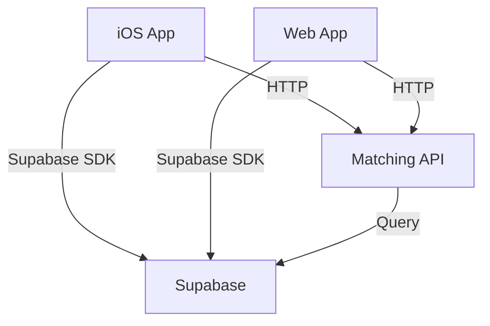

# FindU API Architecture

This document describes the current API landscape and provides guidance for future API development.

## Current Architecture

FindU currently uses a hybrid approach:

<CardGroup cols={2}>
  <Card title="Supabase Direct Access" icon="database">
    Both web and iOS apps communicate directly with Supabase for most operations
  </Card>
  
  <Card title="Matching Algorithm API" icon="brain" href="/matching-algorithm/api-reference">
    Python FastAPI service for ML-powered recommendations
  </Card>
</CardGroup>

### How It Works Today



## Future API Vision

As FindU scales, we may benefit from dedicated API layers:

### Potential Benefits

<Tabs>
  <Tab title="Partner API">
    **Purpose**: Dedicated endpoints for school dashboard features
    
    **Benefits**:
    - Simplified permissions model
    - Aggregated analytics
    - Batch operations
    - Webhook management
    
    **Example Endpoints**:
    - `GET /partner/analytics`
    - `POST /partner/messages/bulk`
    - `GET /partner/students/campaigns`
  </Tab>
  
  <Tab title="Student API">
    **Purpose**: Mobile-optimized endpoints
    
    **Benefits**:
    - Reduced payload sizes
    - Offline support
    - Push notification integration
    - Social features
    
    **Example Endpoints**:
    - `POST /student/swipe`
    - `GET /student/recommendations`
    - `POST /student/profile`
  </Tab>
  
  <Tab title="Admin API">
    **Purpose**: Internal tools and monitoring
    
    **Benefits**:
    - Audit logging
    - Bulk operations
    - System monitoring
    - Content moderation
    
    **Example Endpoints**:
    - `GET /admin/health`
    - `POST /admin/users/suspend`
    - `GET /admin/analytics/platform`
  </Tab>
</Tabs>

## API Design Principles

When building new APIs, follow these principles:

### 1. RESTful Design

```bash
# Resources as nouns
GET    /students         # List
GET    /students/123     # Read
POST   /students         # Create
PUT    /students/123     # Update
DELETE /students/123     # Delete

# Actions as sub-resources
POST   /students/123/swipe
POST   /schools/456/save
```

### 2. Consistent Patterns

#### Request/Response Format
```typescript
// Request
interface ApiRequest<T> {
  data: T;
  metadata?: {
    client_version: string;
    request_id: string;
  };
}

// Response
interface ApiResponse<T> {
  data?: T;
  error?: ApiError;
  metadata: {
    timestamp: string;
    version: string;
  };
}
```

#### Error Handling
```typescript
interface ApiError {
  code: string;          // MACHINE_READABLE_CODE
  message: string;       // Human-friendly message
  details?: unknown;     // Additional context
  help_url?: string;     // Link to docs
}
```

### 3. Authentication

All APIs should use Supabase JWT tokens:

```typescript
// Middleware example
async function authenticate(req: Request) {
  const token = req.headers.get('Authorization')?.replace('Bearer ', '');
  
  if (!token) {
    throw new ApiError('UNAUTHORIZED', 'Missing token');
  }
  
  const { data: user, error } = await supabase.auth.getUser(token);
  
  if (error) {
    throw new ApiError('INVALID_TOKEN', 'Invalid or expired token');
  }
  
  return user;
}
```

### 4. Versioning Strategy

```bash
# URL path versioning
/v1/students
/v2/students  # Breaking changes

# Header versioning for minor changes
X-API-Version: 2024-01-15
```

## Implementation Guidance

### When to Create an API

Consider creating a dedicated API when:

1. **Performance**: Direct Supabase queries become inefficient
2. **Complexity**: Business logic is too complex for RLS policies
3. **Integration**: External partners need access
4. **Mobile**: Need optimized payloads for mobile apps

### Technology Choices

<CardGroup cols={2}>
  <Card title="Node.js/TypeScript" icon="node">
    For web-focused APIs matching our frontend stack
  </Card>
  
  <Card title="Python FastAPI" icon="python">
    For ML/data-heavy operations like matching
  </Card>
  
  <Card title="Edge Functions" icon="bolt">
    For lightweight, globally distributed endpoints
  </Card>
  
  <Card title="GraphQL" icon="diagram-project">
    For complex data relationships and flexible queries
  </Card>
</CardGroup>

### Example API Structure

```typescript
// Example Partner API structure
src/
├── routes/
│   ├── analytics.ts
│   ├── students.ts
│   └── messages.ts
├── middleware/
│   ├── auth.ts
│   ├── rateLimit.ts
│   └── logging.ts
├── services/
│   ├── supabase.ts
│   └── cache.ts
└── types/
    └── api.ts
```

## Documentation Standards

When creating new APIs:

1. **OpenAPI Specification**: Define endpoints in OpenAPI 3.0
2. **Examples**: Provide request/response examples
3. **SDKs**: Generate or create language-specific SDKs
4. **Versioning**: Document all versions and changes
5. **Rate Limits**: Clearly state limits and quotas

## Security Considerations

- **Authentication**: Always require valid JWT tokens
- **Authorization**: Implement proper permission checks
- **Rate Limiting**: Protect against abuse
- **Input Validation**: Validate all inputs
- **CORS**: Configure appropriately for web clients
- **Monitoring**: Log all API access for auditing

## Next Steps

Currently, only the Matching Algorithm has a dedicated API:
- [Matching Algorithm API Reference](/matching-algorithm/api-reference)

For other features, refer to:
- [Supabase Database Schema](/database/overview)
- [Web App Architecture](/web-app/overview)
- [iOS App Architecture](/ios-app/overview)