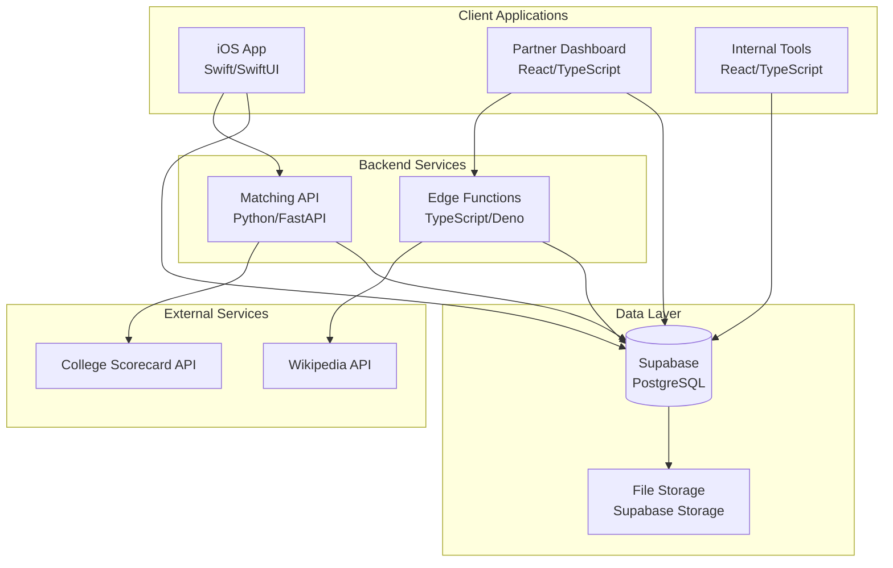
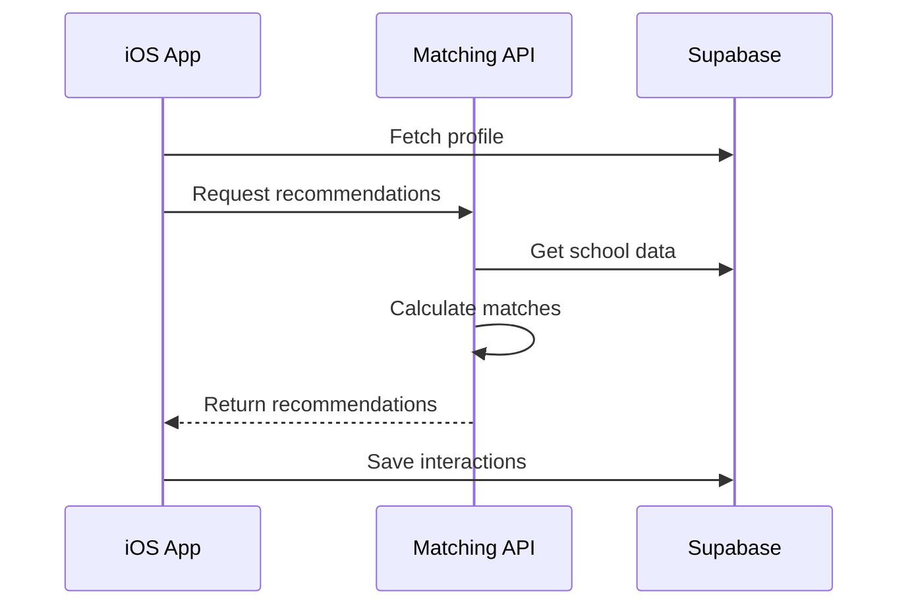
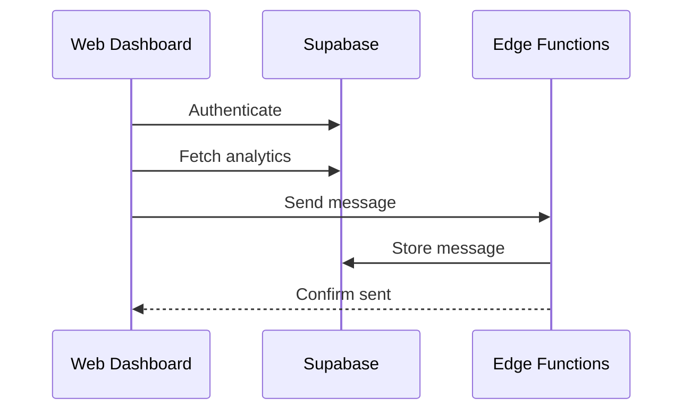
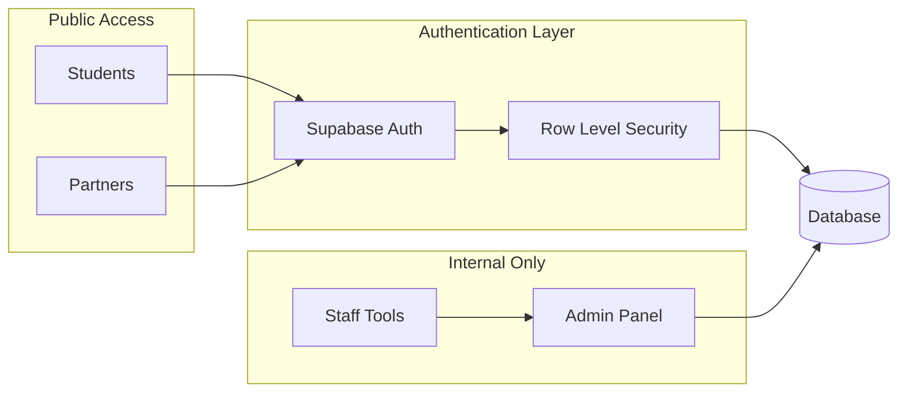
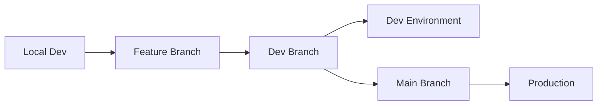

# FindU Architecture

FindU uses a microservices architecture with separate repositories for each major component. This enables independent development, deployment, and scaling.

## System Overview

## Repository Structure

Each component lives in its own repository:

<CardGroup cols={2}>
  <Card title="ios_app" icon="mobile">
    **Purpose**: Native iOS application for students
    - SwiftUI interface
    - Supabase SDK integration
    - Real-time messaging
    - Apple/Google auth
  </Card>
  
  <Card title="web_app" icon="browser">
    **Purpose**: Partner & staff web dashboard
    - React 19 + TypeScript
    - Partner portal features
    - Internal admin tools
    - Analytics & reporting
  </Card>
  
  <Card title="matching-algorithm" icon="brain">
    **Purpose**: ML-powered matching engine
    - Python FastAPI service
    - Student-school matching
    - Recommendation engine
    - Hosted on Railway
  </Card>
  
  <Card title="supabase" icon="database">
    **Purpose**: Database & backend services
    - PostgreSQL schemas
    - Edge Functions
    - RLS policies
    - Database migrations
  </Card>
  
  <Card title="data_scraping" icon="globe">
    **Purpose**: Data collection scripts
    - College Scorecard sync
    - Image scraping
    - Data enrichment
    - Scheduled updates
  </Card>
  
  <Card title="dev-tools" icon="wrench">
    **Purpose**: Developer utilities
    - Setup scripts
    - CLI tools
    - Pre-commit hooks
    - Shared configurations
  </Card>
</CardGroup>

## Data Flow

### 1. Student Matching Flow

### 2. Partner Management Flow

## Environment Architecture

We maintain two separate Supabase projects:

<Tabs>
  <Tab title="Development">
    - **Purpose**: Safe experimentation
    - **Database**: Dev Supabase project
    - **Branches**: All feature work
    - **Deployment**: Automatic from dev branch
    - **Data**: Test data only
  </Tab>
  <Tab title="Production">
    - **Purpose**: Live platform
    - **Database**: Prod Supabase project
    - **Branches**: Main branch only
    - **Deployment**: Automatic from main
    - **Data**: Real user data
  </Tab>
</Tabs>

## Key Design Decisions

### Why Multiple Repositories?

1. **Independent Deployment**: Each service can be deployed separately
2. **Team Autonomy**: Teams can work without blocking each other
3. **Technology Freedom**: Use the best tool for each job
4. **Easier Scaling**: Scale services independently

### Why Supabase?

1. **Real-time Features**: Built-in websockets for messaging
2. **Auth Integration**: Handles authentication complexity
3. **PostgreSQL Power**: Full SQL capabilities
4. **Edge Functions**: Serverless compute at the edge

### Why This Stack?

- **iOS Native**: Better performance and UX than React Native
- **React for Web**: Fast development, great ecosystem
- **Python for ML**: Best libraries for data science
- **Railway Hosting**: Simple deployment, good DX

## Security Architecture

## Deployment Pipeline

All repositories follow the same deployment pattern:

## Next Steps

<CardGroup cols={2}>
  <Card title="Developer Setup" icon="code" href="/developer/initial-setup">
    Get your local environment running
  </Card>
  <Card title="Repository Guide" icon="book" href="/developer/workflow-guide">
    Learn when to work in which repo
  </Card>
</CardGroup>