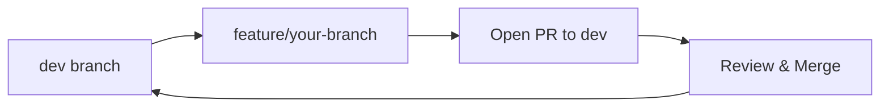

# FindU Development Guide

This guide covers our development workflow, standards, and best practices for the FindU engineering team.

## Repository Overview

<CardGroup cols={2}>
  <Card title="web_app" icon="browser">
    React dashboard for partners
    - Partner analytics
    - Messaging interface
    - Profile management
    - Scholarship tools
  </Card>
  
  <Card title="ios_app" icon="mobile">
    Native iOS app for students
    - College swiping
    - Student messaging
    - Profile creation
    - Social features
  </Card>
  
  <Card title="matching-algorithm" icon="brain">
    ML matching engine
    - Recommendation API
    - Learning algorithms
    - Performance optimization
    - Mobile endpoints
  </Card>
  
  <Card title="supabase" icon="database">
    Backend infrastructure
    - Database schema
    - Edge Functions
    - Authentication
    - Real-time features
  </Card>
</CardGroup>

## Development Process

### 1. Starting New Work

<Steps>
  <Step title="Check Current Sprint">
    - Review sprint board for assigned tasks
    - Check with team lead for priorities
    - Understand acceptance criteria
  </Step>
  
  <Step title="Pull Latest Changes">
    Always start from updated dev branch:
    ```bash
    git checkout dev
    git pull origin dev
    ```
  </Step>
  
  <Step title="Create Feature Branch">
    Use descriptive branch names:
    ```bash
    git checkout -b feature/add-scholarship-filters
    git checkout -b fix/profile-creation-bug
    git checkout -b chore/update-dependencies
    ```
  </Step>
</Steps>

### 2. Making Changes

Always follow our branch strategy:



<Warning>
  Never branch from or PR to `main` directly. Always use `dev` as your base.
</Warning>

### 3. Code Standards

<Tabs>
  <Tab title="TypeScript/React">
    ```typescript
    // Good: Clear naming, proper types
    interface StudentProfile {
      id: string;
      name: string;
      graduationYear: number;
    }
    
    // Good: Descriptive function names
    export function calculateMatchScore(
      student: StudentProfile,
      school: School
    ): number {
      // Implementation
    }
    ```
  </Tab>
  
  <Tab title="Swift/iOS">
    ```swift
    // Good: SwiftUI best practices
    struct StudentCardView: View {
        @StateObject var viewModel: StudentCardViewModel
        
        var body: some View {
            // Clean, composable views
        }
    }
    ```
  </Tab>
  
  <Tab title="Python">
    ```python
    # Good: Type hints and docstrings
    def calculate_match_score(
        student: StudentProfile,
        school: School
    ) -> float:
        """Calculate match score between student and school.
        
        Returns score between 0.0 and 1.0
        """
        # Implementation
    ```
  </Tab>
</Tabs>

### 4. Testing

Before submitting your PR:

- [ ] Run existing tests
- [ ] Add tests for new functionality
- [ ] Test manually in the app
- [ ] Check for console errors
- [ ] Verify mobile responsiveness (if web)

### 5. Pull Request

Use our simplified PR template:

```markdown
## What does this PR do?
[Brief description]

## Type of change
- Bug fix / New feature / Improvement

## How did you test this?
- [ ] I tested this locally
- [ ] Specific things I tested: [list them]

## Screenshots (if UI changes)
[Add screenshots]
```

## Review Process

What happens after you open a PR:

<Steps>
  <Step title="Automated Checks">
    GitHub Actions will run:
    - Linting
    - Type checking
    - Security checks
    - Build verification
  </Step>
  
  <Step title="Code Review">
    Team members will review:
    - Code quality and standards
    - Architecture alignment
    - Performance impact
    - Security considerations
  </Step>
  
  <Step title="Testing">
    - Verify changes work locally
    - Test on dev environment
    - Check for regressions
    - Mobile app: test on devices
  </Step>
  
  <Step title="Merge & Deploy">
    Once approved:
    - PR merged to dev
    - Auto-deployed to dev environment
    - Monitor for issues
    - Plan production release
  </Step>
</Steps>

## Team Communication

<CardGroup cols={2}>
  <Card title="Daily Standup" icon="users">
    Share progress and blockers
    - What you completed
    - What you're working on
    - Any blockers
  </Card>
  
  <Card title="Technical Help" icon="circle-question">
    Getting unstuck:
    - Ask in #dev-help
    - Pair with teammates
    - Schedule 1:1 with lead
  </Card>
  
  <Card title="Design Decisions" icon="compass">
    For architecture questions:
    - Document in PR
    - Discuss in tech meeting
    - Create ADR if needed
  </Card>
  
  <Card title="Sprint Planning" icon="calendar">
    Weekly planning:
    - Review upcoming work
    - Estimate tasks
    - Identify dependencies
  </Card>
</CardGroup>

## Development Standards

### Code Quality
- Write clean, readable code
- Add meaningful comments for complex logic
- Keep functions small and focused
- Follow DRY principles

### Testing
- Write tests for new features
- Maintain existing test coverage
- Test edge cases
- Manual testing before PR

### Documentation
- Update README for significant changes
- Document new APIs
- Keep CLAUDE.md files current
- Add inline documentation

### Security
- Never commit secrets
- Follow security best practices
- Review dependencies
- Report vulnerabilities immediately

## Deployment Process

<Steps>
  <Step title="Development">
    All feature work merges to dev branch
    - Automatically deploys to dev environment
    - Available for team testing
  </Step>
  
  <Step title="Staging">
    Dev branch serves as staging
    - Full testing before production
    - Performance verification
  </Step>
  
  <Step title="Production">
    Weekly production releases
    - Dev → Main merge
    - Deployment automation
    - Post-deploy verification
  </Step>
</Steps>

<Note>
  **Remember**: We're building something amazing together. Quality over speed, communication over assumptions.
</Note>