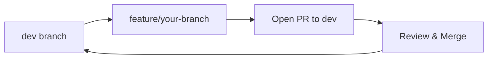

# Contributing to FindU

We love contributions! This guide will help you get started.

## Finding Something to Work On

### Good First Issues

Look for these labels in our repositories:

<CardGroup cols={3}>
  <Card title="good-first-issue" icon="seedling">
    Perfect for newcomers
  </Card>
  <Card title="help-wanted" icon="hand">
    We need help with these
  </Card>
  <Card title="bug" icon="bug">
    Something needs fixing
  </Card>
</CardGroup>

Browse issues: [github.com/orgs/findu-app/issues](https://github.com/orgs/findu-app/issues)

### By Repository

Not sure where to start? Here's what each repo typically needs:

<Tabs>
  <Tab title="web_app">
    - UI/UX improvements
    - New dashboard features
    - Performance optimizations
    - TypeScript migrations
    - Test coverage
  </Tab>
  
  <Tab title="ios_app">
    - SwiftUI enhancements
    - Bug fixes
    - Performance improvements
    - New student features
    - Accessibility updates
  </Tab>
  
  <Tab title="matching-algorithm">
    - Algorithm improvements
    - New matching factors
    - Performance optimization
    - Data analysis
    - API endpoints
  </Tab>
  
  <Tab title="supabase">
    - Database optimizations
    - New Edge Functions
    - Migration scripts
    - RLS policy updates
    - Performance queries
  </Tab>
</Tabs>

## Development Process

### 1. Before You Start

<Steps>
  <Step title="Check Existing Work">
    - Search for existing PRs addressing the issue
    - Check if someone is already assigned
    - Read any discussion on the issue
  </Step>
  
  <Step title="Claim the Issue">
    Comment on the issue: "I'd like to work on this!"
    Wait for assignment before starting major work
  </Step>
  
  <Step title="Understand Context">
    - Read related code and tests
    - Check CLAUDE.md in the repository
    - Ask questions if requirements unclear
  </Step>
</Steps>

### 2. Making Changes

Always follow our branch strategy:



<Warning>
  Never branch from or PR to `main` directly. Always use `dev` as your base.
</Warning>

### 3. Code Standards

<Tabs>
  <Tab title="TypeScript/React">
    ```typescript
    // Good: Clear naming, proper types
    interface StudentProfile {
      id: string;
      name: string;
      graduationYear: number;
    }
    
    // Good: Descriptive function names
    export function calculateMatchScore(
      student: StudentProfile,
      school: School
    ): number {
      // Implementation
    }
    ```
  </Tab>
  
  <Tab title="Swift/iOS">
    ```swift
    // Good: SwiftUI best practices
    struct StudentCardView: View {
        @StateObject var viewModel: StudentCardViewModel
        
        var body: some View {
            // Clean, composable views
        }
    }
    ```
  </Tab>
  
  <Tab title="Python">
    ```python
    # Good: Type hints and docstrings
    def calculate_match_score(
        student: StudentProfile,
        school: School
    ) -> float:
        """Calculate match score between student and school.
        
        Returns score between 0.0 and 1.0
        """
        # Implementation
    ```
  </Tab>
</Tabs>

### 4. Testing

Before submitting your PR:

- [ ] Run existing tests
- [ ] Add tests for new functionality
- [ ] Test manually in the app
- [ ] Check for console errors
- [ ] Verify mobile responsiveness (if web)

### 5. Pull Request

Use our simplified PR template:

```markdown
## What does this PR do?
[Brief description]

## Type of change
- Bug fix / New feature / Improvement

## How did you test this?
- [ ] I tested this locally
- [ ] Specific things I tested: [list them]

## Screenshots (if UI changes)
[Add screenshots]
```

## Review Process

What happens after you open a PR:

<Steps>
  <Step title="Automated Checks">
    GitHub Actions will run:
    - Linting
    - Type checking
    - Tests (if configured)
  </Step>
  
  <Step title="Code Review">
    A team member will review:
    - Code quality
    - Architecture fit
    - Performance impact
  </Step>
  
  <Step title="Feedback">
    - Address review comments
    - Push updates to your branch
    - Re-request review when ready
  </Step>
  
  <Step title="Merge">
    Once approved:
    - PR merged to dev
    - Branch deleted
    - Changes deployed to dev environment
  </Step>
</Steps>

## Getting Help

<CardGroup cols={2}>
  <Card title="Technical Questions" icon="circle-question">
    Ask in #dev-questions with:
    - What you're trying to do
    - What you've tried
    - Error messages/screenshots
  </Card>
  
  <Card title="Design Decisions" icon="compass">
    For architecture questions:
    - Check with team lead
    - Discuss in PR comments
    - Bring to tech standup
  </Card>
</CardGroup>

## Recognition

We value all contributions:

- 🐛 **Bug Fixes**: Every fix improves user experience
- ✨ **Features**: New capabilities for our users  
- 📚 **Documentation**: Helps the whole team
- 🧪 **Tests**: Makes our code more reliable
- ♻️ **Refactoring**: Keeps codebase healthy

Contributors are recognized in:
- Release notes
- Team standups
- Contributor stats

## Code of Conduct

Be respectful, inclusive, and professional:

- Welcome newcomers
- Provide constructive feedback
- Focus on what's best for users
- Assume positive intent

<Note>
  **First time?** Don't be shy! We're here to help. Every expert was once a beginner.
</Note>