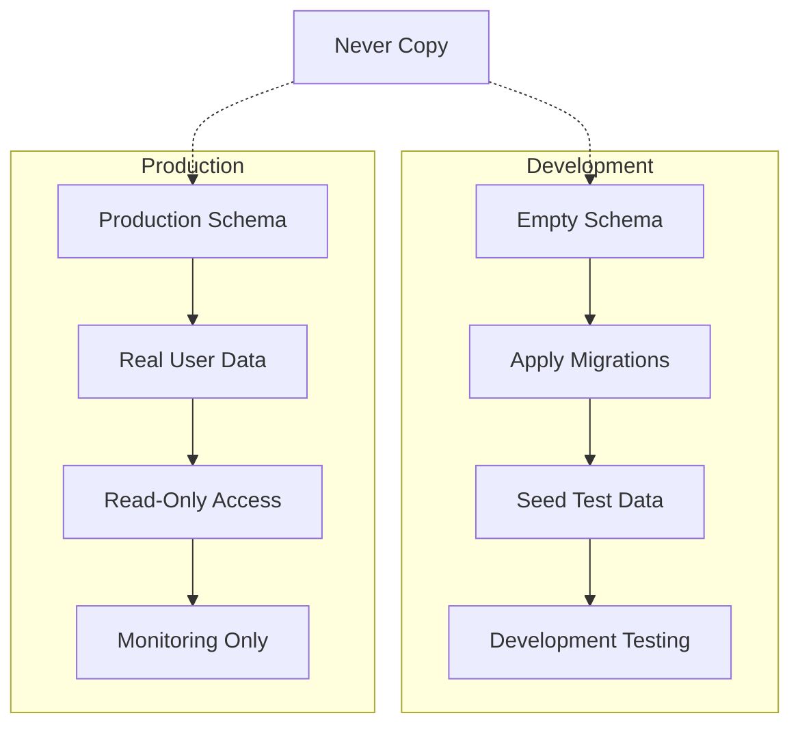

# Data Operations

This guide covers working with data in FindU's Supabase environments, including seeding test data, performing CRUD operations, and safely handling production data.

## Understanding Data Environments

<Warning>
Production data contains real user information and must never be copied to development environments. Always use synthetic test data in development.
</Warning>



## Seeding Test Data

### Creating Seed Files

Organize your seed data in the `supabase/seed.sql` file:

```sql
-- supabase/seed.sql

-- Clear existing test data (dev only!)
TRUNCATE public.students CASCADE;
TRUNCATE public.schools CASCADE;
TRUNCATE public.student_school_interactions CASCADE;

-- Insert test schools
INSERT INTO public.schools (id, api_id, name, city, state, size, admissions_rate, sat_score, act_score, in_state_tuition, out_state_tuition, areas_of_study)
VALUES
  ('550e8400-e29b-41d4-a716-446655440001', '123456', 'Tech University', 'Boston', 'MA', 15000, 0.25, 1400, 32, 55000, 55000, ARRAY['Computer Science', 'Engineering', 'Mathematics']),
  ('550e8400-e29b-41d4-a716-446655440002', '123457', 'Liberal Arts College', 'Portland', 'ME', 2000, 0.45, 1300, 29, 45000, 45000, ARRAY['English', 'History', 'Psychology']),
  ('550e8400-e29b-41d4-a716-446655440003', '123458', 'State University', 'Burlington', 'VT', 25000, 0.65, 1200, 27, 15000, 35000, ARRAY['Business', 'Biology', 'Communications']);

-- Insert test students with varied profiles
INSERT INTO public.students (id, name, email, phone, gpa, sat_score, act_score, graduation_year, preferred_size, distance_from_home, rigor, majors)
VALUES
  ('650e8400-e29b-41d4-a716-446655440001', 'Emma Johnson', 'emma.test@example.com', '555-0101', 3.8, 1350, 30, '2024', 'Medium', 'Within 500 Miles', 'High', ARRAY['Computer Science', 'Data Science']),
  ('650e8400-e29b-41d4-a716-446655440002', 'Liam Smith', 'liam.test@example.com', '555-0102', 3.2, 1200, 26, '2024', 'Large', 'Any Distance', 'Medium', ARRAY['Business', 'Economics']),
  ('650e8400-e29b-41d4-a716-446655440003', 'Olivia Brown', 'olivia.test@example.com', '555-0103', 4.0, 1500, 34, '2024', 'Small', 'Within 100 Miles', 'High', ARRAY['Pre-Med', 'Biology']);

-- Insert test interactions
INSERT INTO public.student_school_interactions (student_id, school_id, viewed, liked, match_score, interaction_date)
VALUES
  ('650e8400-e29b-41d4-a716-446655440001', '550e8400-e29b-41d4-a716-446655440001', true, true, '85', NOW() - INTERVAL '2 days'),
  ('650e8400-e29b-41d4-a716-446655440001', '550e8400-e29b-41d4-a716-446655440002', true, false, '45', NOW() - INTERVAL '1 day'),
  ('650e8400-e29b-41d4-a716-446655440002', '550e8400-e29b-41d4-a716-446655440003', true, true, '75', NOW() - INTERVAL '3 days');

-- Insert test conversations and messages
INSERT INTO public.conversations (id, type, initiator_id, initiator_type, partner_entity_id)
VALUES
  ('750e8400-e29b-41d4-a716-446655440001', 'partner_student', '650e8400-e29b-41d4-a716-446655440001', 'student', null);

INSERT INTO public.messages (conversation_id, sender_id, sender_type, content)
VALUES
  ('750e8400-e29b-41d4-a716-446655440001', '650e8400-e29b-41d4-a716-446655440001', 'student', 'Hi! I am interested in your computer science program.'),
  ('750e8400-e29b-41d4-a716-446655440001', '850e8400-e29b-41d4-a716-446655440001', 'partner', 'Hello Emma! We would love to tell you more about our CS program.');
```

### Running Seeds

<Tabs>
  <Tab title="Local Development">
    ```bash
    # Reset database and apply seeds
    supabase db reset
    
    # Or just run seed file
    psql $DATABASE_URL < supabase/seed.sql
    ```
  </Tab>
  
  <Tab title="Development Supabase">
    ```bash
    # Switch to dev environment
    ./findu env switch dev
    
    # Run seed file
    supabase db push < supabase/seed.sql
    
    # Or use Supabase dashboard SQL editor
    ```
  </Tab>
</Tabs>

### Advanced Seed Patterns

```sql
-- Generate realistic test data with loops
DO $$
DECLARE
  i integer;
  student_id uuid;
  school_ids uuid[];
BEGIN
  -- Get all school IDs
  SELECT ARRAY_AGG(id) INTO school_ids FROM public.schools;
  
  -- Create 100 test students
  FOR i IN 1..100 LOOP
    student_id := gen_random_uuid();
    
    INSERT INTO public.students (
      id, name, email, phone, 
      gpa, sat_score, graduation_year,
      preferred_size, rigor
    ) VALUES (
      student_id,
      'Test Student ' || i,
      'student' || i || '.test@example.com',
      '555-' || LPAD(i::text, 4, '0'),
      (2.5 + random() * 2)::numeric(3,2),  -- GPA 2.5-4.5
      (1000 + random() * 600)::integer,     -- SAT 1000-1600
      (2024 + (random() * 3)::integer)::text,
      CASE (random() * 3)::integer
        WHEN 0 THEN 'Small'
        WHEN 1 THEN 'Medium'
        ELSE 'Large'
      END,
      CASE (random() * 3)::integer
        WHEN 0 THEN 'Low'
        WHEN 1 THEN 'Medium'
        ELSE 'High'
      END
    );
    
    -- Create 5-15 interactions per student
    FOR j IN 1..(5 + (random() * 10)::integer) LOOP
      INSERT INTO public.student_school_interactions (
        student_id, school_id, viewed, liked, match_score
      ) VALUES (
        student_id,
        school_ids[1 + (random() * array_length(school_ids, 1))::integer],
        true,
        random() > 0.5,
        (50 + random() * 50)::integer::text
      );
    END LOOP;
  END LOOP;
END $$;
```

## CRUD Operations

### Using Supabase Client

<CodeGroup>
```typescript Create
// Create a new student
const { data, error } = await supabase
  .from('students')
  .insert({
    name: 'New Student',
    email: 'new.student@example.com',
    phone: '555-0001',
    gpa: 3.5,
    graduation_year: '2024',
    // ... other required fields
  })
  .select()
  .single();

// Bulk create
const { data, error } = await supabase
  .from('student_school_interactions')
  .insert([
    { student_id: 'uuid1', school_id: 'uuid2', liked: true },
    { student_id: 'uuid1', school_id: 'uuid3', liked: false },
  ]);
```

```typescript Read
// Simple select
const { data: students } = await supabase
  .from('students')
  .select('*')
  .eq('graduation_year', '2024');

// With joins
const { data: interactions } = await supabase
  .from('student_school_interactions')
  .select(`
    *,
    student:students(name, email),
    school:schools(name, city, state)
  `)
  .eq('liked', true)
  .order('interaction_date', { ascending: false })
  .limit(10);

// Complex query
const { data } = await supabase
  .from('students')
  .select(`
    id, name, gpa,
    interactions:student_school_interactions(count)
  `)
  .gte('gpa', 3.5)
  .in('graduation_year', ['2024', '2025']);
```

```typescript Update
// Update single record
const { error } = await supabase
  .from('students')
  .update({ gpa: 3.7 })
  .eq('id', studentId);

// Bulk update with filter
const { error } = await supabase
  .from('student_school_interactions')
  .update({ viewed: true })
  .eq('student_id', studentId)
  .is('viewed', false);

// Upsert (insert or update)
const { error } = await supabase
  .from('user_preferences')
  .upsert({
    student_id: studentId,
    theme: 'dark',
    notifications_enabled: true
  }, {
    onConflict: 'student_id'
  });
```

```typescript Delete
// Soft delete (recommended)
const { error } = await supabase
  .from('students')
  .update({ deleted_at: new Date().toISOString() })
  .eq('id', studentId);

// Hard delete (use carefully)
const { error } = await supabase
  .from('student_school_interactions')
  .delete()
  .eq('student_id', studentId)
  .eq('school_id', schoolId);

// Delete with return
const { data: deleted } = await supabase
  .from('messages')
  .delete()
  .eq('id', messageId)
  .select()
  .single();
```
</CodeGroup>

### Direct SQL Operations

For complex operations, use SQL directly:

```sql
-- Complex update with subquery
UPDATE public.students s
SET match_count = (
  SELECT COUNT(*)
  FROM public.student_school_interactions ssi
  WHERE ssi.student_id = s.id
    AND ssi.liked = true
    AND ssi.match_score::integer > 70
)
WHERE s.graduation_year = '2024';

-- Batch operations with CTEs
WITH inactive_students AS (
  SELECT id
  FROM public.students
  WHERE NOT EXISTS (
    SELECT 1 FROM public.student_school_interactions
    WHERE student_id = students.id
      AND interaction_date > NOW() - INTERVAL '30 days'
  )
)
UPDATE public.students
SET status = 'inactive'
WHERE id IN (SELECT id FROM inactive_students);

-- Complex data migration
INSERT INTO public.partner_affiliations (partner_user_id, entity_id, role)
SELECT 
  pu.id,
  pe.id,
  'admissions_officer'
FROM public.partner_users pu
CROSS JOIN public.partner_entities pe
WHERE pu.email LIKE '%@' || 
  SUBSTRING(pe.name FROM '.* ([^ ]+)$') || '.edu'
ON CONFLICT (partner_user_id, entity_id) DO NOTHING;
```

## Using Supabase Studio

### Visual Data Editor

<Steps>
  <Step title="Access Table Editor">
    Navigate to Table Editor in Supabase Dashboard
  </Step>
  
  <Step title="Filter and Sort">
    Use the UI to filter, sort, and search data
  </Step>
  
  <Step title="Edit Inline">
    Click any cell to edit directly (respects RLS)
  </Step>
  
  <Step title="Export Data">
    Export filtered results as CSV for analysis
  </Step>
</Steps>

### SQL Editor Best Practices

```sql
-- Always use transactions for multiple operations
BEGIN;

-- Your operations here
UPDATE public.students SET status = 'active' WHERE id = 'uuid';
INSERT INTO public.activity_log (action, student_id) VALUES ('activated', 'uuid');

-- Verify before committing
SELECT * FROM public.students WHERE id = 'uuid';
SELECT * FROM public.activity_log WHERE student_id = 'uuid' ORDER BY created_at DESC LIMIT 1;

-- If good, commit; otherwise rollback
COMMIT;
-- or
-- ROLLBACK;
```

## Data Import/Export

### Importing Data

<Tabs>
  <Tab title="CSV Import">
    ```sql
    -- Create temporary table
    CREATE TEMP TABLE import_schools (
      name text,
      city text,
      state text,
      size integer
    );
    
    -- Copy CSV data (in Supabase, use Table Editor import)
    COPY import_schools FROM '/path/to/schools.csv' CSV HEADER;
    
    -- Insert with validation
    INSERT INTO public.schools (name, city, state, size, api_id)
    SELECT 
      name, 
      city, 
      state, 
      size,
      'IMPORT-' || gen_random_uuid()::text
    FROM import_schools
    WHERE name IS NOT NULL
      AND city IS NOT NULL
      AND state IS NOT NULL;
    ```
  </Tab>
  
  <Tab title="JSON Import">
    ```sql
    -- Import from JSON
    WITH json_data AS (
      SELECT jsonb_array_elements('[
        {"name": "Test College", "city": "Boston", "state": "MA"},
        {"name": "Sample University", "city": "NYC", "state": "NY"}
      ]'::jsonb) AS school
    )
    INSERT INTO public.schools (name, city, state, api_id)
    SELECT 
      school->>'name',
      school->>'city',
      school->>'state',
      'JSON-' || gen_random_uuid()::text
    FROM json_data;
    ```
  </Tab>
</Tabs>

### Exporting Data

```sql
-- Export for analysis (remove PII)
COPY (
  SELECT 
    s.graduation_year,
    s.gpa,
    s.preferred_size,
    COUNT(ssi.id) as interactions,
    COUNT(CASE WHEN ssi.liked THEN 1 END) as likes
  FROM public.students s
  LEFT JOIN public.student_school_interactions ssi ON s.id = ssi.student_id
  GROUP BY s.graduation_year, s.gpa, s.preferred_size
) TO '/tmp/student_analytics.csv' CSV HEADER;

-- Export for backup (dev only)
pg_dump $DATABASE_URL \
  --table=students \
  --table=schools \
  --table=student_school_interactions \
  --data-only \
  --file=dev_backup.sql
```

## Data Privacy & Security

### Anonymizing Test Data

```sql
-- Function to anonymize PII
CREATE OR REPLACE FUNCTION anonymize_students()
RETURNS void AS $$
DECLARE
  r record;
  counter integer := 1;
BEGIN
  FOR r IN SELECT id FROM public.students LOOP
    UPDATE public.students
    SET 
      name = 'Student ' || counter,
      email = 'student' || counter || '@example.com',
      phone = '555-' || LPAD(counter::text, 4, '0'),
      address = counter || ' Test Street'
    WHERE id = r.id;
    
    counter := counter + 1;
  END LOOP;
END;
$$ LANGUAGE plpgsql;

-- Run anonymization (DEV ONLY!)
SELECT anonymize_students();
```

### Production Data Access

<Warning>
Production data access should be restricted and audited. Never run write operations directly in production.
</Warning>

```sql
-- Read-only queries only
-- Example: Checking data integrity
SELECT 
  COUNT(*) as total_students,
  COUNT(DISTINCT email) as unique_emails,
  COUNT(CASE WHEN email IS NULL THEN 1 END) as missing_emails
FROM public.students
WHERE deleted_at IS NULL;

-- Monitoring queries
SELECT 
  DATE(created_at) as signup_date,
  COUNT(*) as new_students
FROM public.students
WHERE created_at > NOW() - INTERVAL '30 days'
GROUP BY DATE(created_at)
ORDER BY signup_date DESC;
```

## Performance Considerations

### Batch Operations

```sql
-- Use COPY for bulk inserts
COPY public.schools (api_id, name, city, state) FROM STDIN CSV;
12345,Harvard University,Cambridge,MA
12346,MIT,Cambridge,MA
\.

-- Batch updates with temp table
CREATE TEMP TABLE update_batch (
  student_id uuid,
  new_gpa numeric(3,2)
);

-- Load your updates
INSERT INTO update_batch VALUES 
  ('uuid1', 3.7),
  ('uuid2', 3.8);

-- Apply updates efficiently
UPDATE public.students s
SET gpa = u.new_gpa
FROM update_batch u
WHERE s.id = u.student_id;
```

### Query Optimization

```sql
-- Use indexes effectively
EXPLAIN ANALYZE
SELECT * FROM public.student_school_interactions
WHERE student_id = 'uuid' AND liked = true;

-- Paginate large results
SELECT * FROM public.students
WHERE graduation_year = '2024'
ORDER BY created_at DESC
LIMIT 50
OFFSET 100;

-- Use CTEs for complex queries
WITH active_students AS (
  SELECT DISTINCT student_id
  FROM public.student_school_interactions
  WHERE interaction_date > NOW() - INTERVAL '7 days'
)
SELECT s.*
FROM public.students s
JOIN active_students a ON s.id = a.student_id
ORDER BY s.name;
```

## Troubleshooting Data Issues

<AccordionGroup>
  <Accordion title="Duplicate key violations">
    Check for existing records before insert:
    ```sql
    INSERT INTO public.students (email, name)
    SELECT 'new@example.com', 'New Student'
    WHERE NOT EXISTS (
      SELECT 1 FROM public.students 
      WHERE email = 'new@example.com'
    );
    ```
  </Accordion>
  
  <Accordion title="Foreign key constraints">
    Ensure referenced records exist:
    ```sql
    -- Check before insert
    SELECT COUNT(*) FROM public.schools WHERE id = 'school-uuid';
    
    -- Or use ON CONFLICT
    INSERT INTO public.student_school_interactions 
      (student_id, school_id)
    VALUES 
      ('student-uuid', 'school-uuid')
    ON CONFLICT DO NOTHING;
    ```
  </Accordion>
  
  <Accordion title="RLS blocking operations">
    Test with service role key or check policies:
    ```sql
    -- Check current user
    SELECT auth.uid();
    
    -- Test policy
    SELECT * FROM public.students
    WHERE auth.uid() IN (
      SELECT user_id FROM public.profiles 
      WHERE student_id = students.id
    );
    ```
  </Accordion>
  
  <Accordion title="Performance issues">
    Identify slow queries:
    ```sql
    -- Enable timing
    \timing on
    
    -- Run query with explain
    EXPLAIN (ANALYZE, BUFFERS) 
    SELECT ... your slow query ...;
    
    -- Check missing indexes
    SELECT schemaname, tablename, attname, n_distinct, correlation
    FROM pg_stats
    WHERE tablename = 'your_table';
    ```
  </Accordion>
</AccordionGroup>

---

Next, learn about [troubleshooting database issues](/database/troubleshooting) or return to the [database overview](/database/overview).