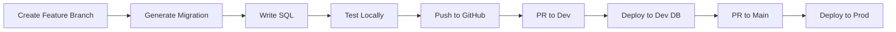

# Database Migrations Guide

Migrations are version-controlled changes to your database schema. This guide walks through creating, testing, and deploying migrations in the FindU ecosystem.

## Migration Workflow Overview



## Creating Your First Migration

<Steps>
  <Step title="Set up your environment">
    ```bash
    # Ensure you're in dev environment
    ./findu env switch dev
    
    # Navigate to supabase directory
    cd supabase
    ```
  </Step>
  
  <Step title="Create a feature branch">
    ```bash
    git checkout dev
    git pull origin dev
    git checkout -b feature/add-user-preferences
    ```
  </Step>
  
  <Step title="Generate migration file">
    ```bash
    supabase migration new add_user_preferences_table
    ```
    
    This creates a timestamped file in `supabase/migrations/`:
    ```
    20240205123456_add_user_preferences_table.sql
    ```
  </Step>
  
  <Step title="Write your migration">
    Edit the generated file with your SQL:
    
    ```sql
    -- Create user preferences table
    CREATE TABLE IF NOT EXISTS public.user_preferences (
      id uuid PRIMARY KEY DEFAULT gen_random_uuid(),
      student_id uuid NOT NULL REFERENCES public.students(id) ON DELETE CASCADE,
      theme text DEFAULT 'light' CHECK (theme IN ('light', 'dark', 'auto')),
      notifications_enabled boolean DEFAULT true,
      created_at timestamptz DEFAULT now(),
      updated_at timestamptz DEFAULT now()
    );
    
    -- Add RLS policies
    ALTER TABLE public.user_preferences ENABLE ROW LEVEL SECURITY;
    
    -- Students can only see their own preferences
    CREATE POLICY "Students can view own preferences" 
      ON public.user_preferences FOR SELECT
      USING (auth.uid() IN (
        SELECT user_id FROM public.profiles WHERE student_id = user_preferences.student_id
      ));
    
    -- Students can update their own preferences
    CREATE POLICY "Students can update own preferences"
      ON public.user_preferences FOR UPDATE
      USING (auth.uid() IN (
        SELECT user_id FROM public.profiles WHERE student_id = user_preferences.student_id
      ));
    
    -- Create updated_at trigger
    CREATE TRIGGER update_user_preferences_updated_at
      BEFORE UPDATE ON public.user_preferences
      FOR EACH ROW
      EXECUTE FUNCTION update_updated_at_column();
    ```
  </Step>
  
  <Step title="Test locally">
    ```bash
    # Reset local database (applies all migrations)
    supabase db reset
    
    # Verify your changes
    supabase db diff
    ```
  </Step>
  
  <Step title="Commit and push">
    ```bash
    git add .
    git commit -m "feat: add user preferences table with RLS"
    git push origin feature/add-user-preferences
    ```
  </Step>
  
  <Step title="Create pull request">
    ```bash
    gh pr create --base dev --title "Add user preferences table" \
      --body "Adds table for storing user theme and notification preferences"
    ```
  </Step>
</Steps>

## Types of Migrations

### Schema Migrations

<Tabs>
  <Tab title="Creating Tables">
    ```sql
    -- Always use IF NOT EXISTS for safety
    CREATE TABLE IF NOT EXISTS public.feature_flags (
      id uuid PRIMARY KEY DEFAULT gen_random_uuid(),
      name text NOT NULL UNIQUE,
      enabled boolean DEFAULT false,
      rollout_percentage integer DEFAULT 0 CHECK (rollout_percentage BETWEEN 0 AND 100),
      created_at timestamptz DEFAULT now()
    );
    
    -- Always add RLS
    ALTER TABLE public.feature_flags ENABLE ROW LEVEL SECURITY;
    
    -- Add appropriate indexes
    CREATE INDEX idx_feature_flags_name ON public.feature_flags(name);
    ```
  </Tab>
  
  <Tab title="Altering Tables">
    ```sql
    -- Add columns with defaults for existing rows
    ALTER TABLE public.students 
      ADD COLUMN IF NOT EXISTS onboarding_completed boolean DEFAULT false;
    
    -- Rename columns carefully
    ALTER TABLE public.students 
      RENAME COLUMN old_name TO new_name;
    
    -- Add constraints
    ALTER TABLE public.students
      ADD CONSTRAINT check_gpa CHECK (gpa >= 0 AND gpa <= 5.0);
    ```
  </Tab>
  
  <Tab title="Creating Indexes">
    ```sql
    -- Standard index
    CREATE INDEX CONCURRENTLY IF NOT EXISTS idx_students_graduation_year 
      ON public.students(graduation_year);
    
    -- Partial index for performance
    CREATE INDEX CONCURRENTLY IF NOT EXISTS idx_active_conversations
      ON public.conversations(updated_at)
      WHERE closed_at IS NULL;
    
    -- Composite index
    CREATE INDEX CONCURRENTLY IF NOT EXISTS idx_interactions_student_school
      ON public.student_school_interactions(student_id, school_id);
    ```
  </Tab>
</Tabs>

### Data Migrations

<Warning>
Data migrations should be idempotent - running them multiple times should have the same result.
</Warning>

```sql
-- Example: Backfill data with proper checks
UPDATE public.students 
SET areas_of_interest = ARRAY['undecided']
WHERE areas_of_interest IS NULL 
  OR array_length(areas_of_interest, 1) = 0;

-- Example: Migrate data between tables
INSERT INTO public.user_preferences (student_id, theme, notifications_enabled)
SELECT 
  id as student_id,
  COALESCE(settings->>'theme', 'light') as theme,
  COALESCE((settings->>'notifications')::boolean, true) as notifications_enabled
FROM public.students
WHERE NOT EXISTS (
  SELECT 1 FROM public.user_preferences WHERE student_id = students.id
);
```

### Creating Functions

```sql
-- Utility function for updated_at timestamps
CREATE OR REPLACE FUNCTION update_updated_at_column()
RETURNS TRIGGER AS $$
BEGIN
  NEW.updated_at = now();
  RETURN NEW;
END;
$$ LANGUAGE plpgsql;

-- Domain-specific function
CREATE OR REPLACE FUNCTION calculate_match_score(
  student_id uuid,
  school_id uuid
) RETURNS numeric AS $$
DECLARE
  score numeric;
BEGIN
  -- Your matching logic here
  SELECT 
    CASE 
      WHEN s.gpa >= sch.min_gpa THEN 0.25
      ELSE 0
    END +
    -- Add more scoring logic
    0.5 -- Base score
  INTO score
  FROM public.students s, public.schools sch
  WHERE s.id = student_id AND sch.id = school_id;
  
  RETURN COALESCE(score, 0);
END;
$$ LANGUAGE plpgsql;
```

## Testing Migrations

### Local Testing Checklist

<Checklist>
- [ ] Run `supabase db reset` successfully
- [ ] Verify schema changes in Supabase Studio
- [ ] Test with sample data
- [ ] Check that RLS policies work correctly
- [ ] Ensure no breaking changes for existing code
- [ ] Verify rollback plan if needed
</Checklist>

### Writing Rollback Migrations

For risky changes, prepare a rollback migration:

```sql
-- Migration: 20240205123456_add_complex_feature.sql
-- Rollback: 20240205123457_rollback_complex_feature.sql

-- Drop new constraints
ALTER TABLE public.students DROP CONSTRAINT IF EXISTS check_gpa;

-- Drop new columns
ALTER TABLE public.students DROP COLUMN IF EXISTS new_feature;

-- Drop new tables
DROP TABLE IF EXISTS public.user_preferences CASCADE;
```

## Deployment Process

### To Development

1. **Automatic**: Merging PR to `dev` branch triggers deployment
2. **Manual**: If needed, run `supabase db push` after switching to dev

### To Production

1. **Create PR**: From `dev` to `main` branch
2. **Review Required**: Another developer must approve
3. **Automatic Deploy**: Merging triggers production deployment
4. **Monitor**: Check Supabase dashboard for any issues

## Best Practices

<CardGroup cols={2}>
  <Card title="Always Include RLS" icon="shield">
    Every table should have Row Level Security enabled and appropriate policies
  </Card>
  
  <Card title="Make Migrations Idempotent" icon="repeat">
    Use `IF NOT EXISTS`, `IF EXISTS`, and proper checks
  </Card>
  
  <Card title="One Concern Per Migration" icon="1">
    Keep migrations focused on a single feature or change
  </Card>
  
  <Card title="Test Thoroughly" icon="flask">
    Always run `supabase db reset` before pushing
  </Card>
</CardGroup>

## Common Patterns

### Adding Audit Fields

```sql
-- Standard audit fields for new tables
created_at timestamptz DEFAULT now(),
updated_at timestamptz DEFAULT now(),
created_by uuid REFERENCES auth.users(id),
updated_by uuid REFERENCES auth.users(id)
```

### Setting Up RLS

```sql
-- Enable RLS
ALTER TABLE public.table_name ENABLE ROW LEVEL SECURITY;

-- Public read access
CREATE POLICY "Public can view" ON public.table_name
  FOR SELECT USING (true);

-- Authenticated write access
CREATE POLICY "Authenticated can insert" ON public.table_name
  FOR INSERT WITH CHECK (auth.role() = 'authenticated');

-- Owner-only access
CREATE POLICY "Users can manage own records" ON public.table_name
  FOR ALL USING (auth.uid() = user_id);
```

### Performance Indexes

```sql
-- Foreign key indexes (often missed)
CREATE INDEX idx_table_foreign_key ON public.table_name(foreign_key_id);

-- Timestamp indexes for queries
CREATE INDEX idx_table_created_at ON public.table_name(created_at DESC);

-- Text search indexes
CREATE INDEX idx_table_search ON public.table_name USING gin(to_tsvector('english', name || ' ' || description));
```

## Troubleshooting

<AccordionGroup>
  <Accordion title="Migration fails with 'already exists' error">
    Your migration isn't idempotent. Add `IF NOT EXISTS` checks:
    ```sql
    CREATE TABLE IF NOT EXISTS ...
    CREATE INDEX IF NOT EXISTS ...
    ALTER TABLE ... ADD COLUMN IF NOT EXISTS ...
    ```
  </Accordion>
  
  <Accordion title="RLS policies blocking access">
    Test policies in Supabase dashboard:
    1. Go to Authentication > Policies
    2. Use the policy editor to test with different users
    3. Check policy conditions carefully
  </Accordion>
  
  <Accordion title="Migration works locally but fails in CI">
    Common causes:
    - Missing `IF EXISTS` checks
    - Dependency on data that doesn't exist
    - Different Postgres versions
    - Timezone issues with timestamps
  </Accordion>
  
  <Accordion title="Need to modify a migration">
    Never modify a migration that's been deployed. Instead:
    1. Create a new migration to fix the issue
    2. Include proper rollback handling
    3. Test the upgrade path thoroughly
  </Accordion>
</AccordionGroup>

---

Next, learn about [schema management](/database/schema-management) or [data operations](/database/data-operations).