# Database Overview

FindU uses Supabase as its backend platform, providing PostgreSQL databases, authentication, real-time subscriptions, and file storage. This guide explains our database architecture and why we maintain separate development and production environments.

## Architecture Overview

<Info>
FindU maintains completely separate Supabase projects for development and production to ensure data safety and enable worry-free experimentation.
</Info>


## Why Dev Database is Empty

The development database intentionally starts empty (schema only) for several critical reasons:

<CardGroup cols={2}>
  <Card title="Data Privacy" icon="shield">
    **Protecting User Information**
    
    Real user data must never leave production. This includes:
    - Personal information (names, emails, addresses)
    - Academic records (GPAs, test scores)
    - Private messages and interactions
    - Financial aid information
  </Card>
  
  <Card title="Development Safety" icon="hard-hat">
    **Risk-Free Experimentation**
    
    An empty dev database allows you to:
    - Test destructive operations safely
    - Create edge-case scenarios
    - Run performance tests
    - Experiment with schema changes
  </Card>
  
  <Card title="Compliance" icon="scale-balanced">
    **Regulatory Requirements**
    
    Many regulations require:
    - Data minimization in non-production
    - Audit trails for data access
    - Geographic data residency
    - Right to deletion compliance
  </Card>
  
  <Card title="Clean Testing" icon="flask">
    **Predictable Test Environment**
    
    Empty databases provide:
    - Consistent starting state
    - Reproducible test scenarios
    - No production data pollution
    - Faster test execution
  </Card>
</CardGroup>

## Environment Comparison

| Aspect | Development | Production |
|--------|------------|------------|
| **Data** | Empty or test data only | Real user data |
| **Access** | All developers | Limited team members |
| **Backups** | Optional/manual | Automated daily |
| **RLS** | Can be disabled for testing | Always enforced |
| **Migrations** | Test first | Deploy after dev testing |
| **Performance** | Smaller instance | Scaled for traffic |
| **Cost** | Free tier | Paid plan |

## Database Schema Structure

Our database is organized into several key areas:

### Core Tables
- **students** - Student profiles and preferences
- **schools** - College information and statistics  
- **student_school_interactions** - Swipe history and matches
- **messages** & **conversations** - Chat system

### Partner System
- **partner_organizations** - Universities, companies, nonprofits
- **partner_entities** - Specific programs or departments
- **partner_users** - Admissions staff accounts
- **partner_affiliations** - Role assignments

### Supporting Tables
- **scholarships** - Financial aid opportunities
- **friendships** - Student social connections
- **notifications** - System notifications

## Working with Environments

### Switching Between Environments

<Tabs>
  <Tab title="Development">
    ```bash
    # Switch to dev environment
    ./findu env switch dev
    
    # Verify you're in dev
    ./findu env status
    # Output: Current environment: dev
    ```
    
    Use dev for:
    - Daily development work
    - Testing new features
    - Running migrations locally
    - Experimenting with data
  </Tab>
  
  <Tab title="Production">
    ```bash
    # Switch to production (use caution!)
    ./findu env switch prod
    
    # Double-check before any operations
    ./findu env status
    # Output: Current environment: prod
    ```
    
    Use prod only for:
    - Debugging production issues
    - Emergency fixes
    - Data verification
    - Monitoring
  </Tab>
</Tabs>

<Warning>
Always verify your current environment before running database operations. Production mistakes can affect real users!
</Warning>

## Data Flow

### Schema Changes (Migrations)

```mermaid
sequenceDiagram
    participant Dev as Developer
    participant Local as Local DB
    participant DevDB as Dev Supabase
    participant PR as Pull Request
    participant ProdDB as Prod Supabase
    
    Dev->>Local: Create migration
    Dev->>Local: Test with db reset
    Dev->>DevDB: Push to feature branch
    Dev->>PR: Create PR to dev
    PR->>DevDB: Auto-deploy on merge
    PR->>ProdDB: Deploy when dev→main
```


### Test Data Creation
1. **Local Seed Files**: Create SQL files for test data
2. **Dev Database**: Apply seeds after migrations
3. **Never in Production**: Seeds only run in dev

## Security Considerations

### Access Control
- Each environment has separate credentials
- Service role keys are environment-specific  
- Personal access tokens for individual developers
- RLS policies enforced in production

### Data Isolation
- No cross-environment queries
- Separate connection strings
- Different project IDs
- Isolated storage buckets

## Best Practices

<Steps>
  <Step title="Default to Development">
    Always work in dev unless specifically debugging production
  </Step>
  
  <Step title="Test Migrations Thoroughly">
    Run `supabase db reset` locally before pushing any migration
  </Step>
  
  <Step title="Create Realistic Test Data">
    Build comprehensive seed files that cover edge cases
  </Step>
  
  <Step title="Monitor Production Carefully">
    Use Supabase dashboard for read-only production inspection
  </Step>
  
  <Step title="Document Data Decisions">
    Explain why certain data exists only in production
  </Step>
</Steps>

## Common Questions

<AccordionGroup>
  <Accordion title="Can I copy some production data to dev?">
    Generally no. If you need realistic data, create anonymized seed data that mimics production patterns without using real user information.
  </Accordion>
  
  <Accordion title="How do I debug a production issue?">
    1. First, try to reproduce in dev with test data
    2. Use Supabase dashboard for read-only inspection
    3. If you must query production, use read-only queries
    4. Never modify production data directly
  </Accordion>
  
  <Accordion title="What about staging environment?">
    Currently, we use dev as our staging environment. Feature branches can create preview databases for isolated testing.
  </Accordion>
</AccordionGroup>

---

Next, learn about [creating and managing migrations](/database/migrations-guide) or [working with the schema](/database/schema-management).