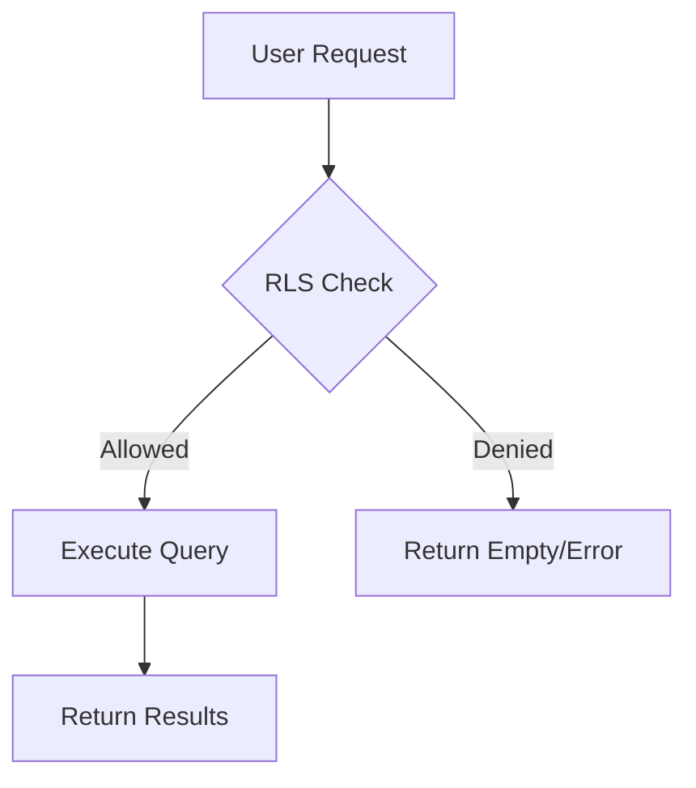

# Schema Management

This guide covers managing your database schema beyond basic migrations, including Row Level Security (RLS), functions, triggers, and type safety.

## Table Design Principles

### Naming Conventions

<Tabs>
  <Tab title="Tables">
    ```sql
    -- Use snake_case plural nouns
    CREATE TABLE public.students (...);
    CREATE TABLE public.student_school_interactions (...);
    CREATE TABLE public.partner_entities (...);
    
    -- Not: Student, StudentSchoolInteraction, partnerEntities
    ```
  </Tab>
  
  <Tab title="Columns">
    ```sql
    -- Use snake_case
    CREATE TABLE public.students (
      id uuid PRIMARY KEY,
      first_name text NOT NULL,
      graduation_year integer,
      created_at timestamptz DEFAULT now()
    );
    
    -- Not: firstName, graduationYear, createdAt
    ```
  </Tab>
  
  <Tab title="Constraints">
    ```sql
    -- Format: table_column_type
    ALTER TABLE public.students
      ADD CONSTRAINT students_email_unique UNIQUE (email);
    
    ALTER TABLE public.students  
      ADD CONSTRAINT students_gpa_check CHECK (gpa >= 0 AND gpa <= 5.0);
    
    -- Foreign keys: fk_table_column
    ALTER TABLE public.messages
      ADD CONSTRAINT fk_messages_conversation 
      FOREIGN KEY (conversation_id) 
      REFERENCES public.conversations(id);
    ```
  </Tab>
</Tabs>

### Standard Table Structure

Every table should include these common patterns:

```sql
CREATE TABLE public.your_table (
  -- Primary key
  id uuid PRIMARY KEY DEFAULT gen_random_uuid(),
  
  -- Your columns here
  name text NOT NULL,
  description text,
  
  -- Audit fields
  created_at timestamptz DEFAULT now(),
  updated_at timestamptz DEFAULT now(),
  
  -- Soft delete (optional)
  deleted_at timestamptz
);

-- Enable RLS
ALTER TABLE public.your_table ENABLE ROW LEVEL SECURITY;

-- Add updated_at trigger
CREATE TRIGGER update_your_table_updated_at
  BEFORE UPDATE ON public.your_table
  FOR EACH ROW
  EXECUTE FUNCTION update_updated_at_column();

-- Add indexes for foreign keys and common queries
CREATE INDEX idx_your_table_created_at ON public.your_table(created_at DESC);
```

## Row Level Security (RLS)

### RLS Strategy

<Info>
RLS is your first line of defense. Every table should have RLS enabled with appropriate policies.
</Info>



### Common RLS Patterns

<CodeGroup>
```sql Public Read
-- Anyone can read (careful with this!)
CREATE POLICY "Public read access"
  ON public.schools
  FOR SELECT
  USING (true);

-- Only non-deleted records
CREATE POLICY "Public read non-deleted"
  ON public.schools
  FOR SELECT
  USING (deleted_at IS NULL);
```

```sql Authenticated Access
-- Any logged-in user can read
CREATE POLICY "Authenticated read"
  ON public.conversations
  FOR SELECT
  USING (auth.role() = 'authenticated');

-- Authenticated users can create
CREATE POLICY "Authenticated create"
  ON public.messages
  FOR INSERT
  WITH CHECK (
    auth.role() = 'authenticated' 
    AND sender_id = auth.uid()
  );
```

```sql Owner Access
-- Users own their records
CREATE POLICY "Users manage own profile"
  ON public.profiles
  FOR ALL
  USING (user_id = auth.uid())
  WITH CHECK (user_id = auth.uid());

-- Through a join table
CREATE POLICY "Students see own interactions"
  ON public.student_school_interactions
  FOR SELECT
  USING (
    student_id IN (
      SELECT id FROM public.students
      WHERE user_id = auth.uid()
    )
  );
```

```sql Role-Based Access
-- Check user role from another table
CREATE POLICY "Admins full access"
  ON public.schools
  FOR ALL
  USING (
    EXISTS (
      SELECT 1 FROM public.partner_users
      WHERE user_id = auth.uid()
      AND role = 'admin'
    )
  );

-- Organization members
CREATE POLICY "Org members access"
  ON public.partner_entities
  FOR SELECT
  USING (
    organization_id IN (
      SELECT organization_id 
      FROM public.partner_affiliations
      WHERE partner_user_id = auth.uid()
    )
  );
```
</CodeGroup>

### Testing RLS Policies

Always test your policies in the Supabase dashboard:

<Steps>
  <Step title="Navigate to Auth Policies">
    Go to Database → Tables → Select table → Policies
  </Step>
  
  <Step title="Use Policy Editor">
    Click "New policy" and use the template editor
  </Step>
  
  <Step title="Test with Different Users">
    Use "Test policy" with different user contexts
  </Step>
  
  <Step title="Check SQL Directly">
    ```sql
    -- Test as anonymous
    SET request.jwt.claim.sub TO NULL;
    SELECT * FROM public.your_table;
    
    -- Test as specific user
    SET request.jwt.claim.sub TO 'user-uuid-here';
    SELECT * FROM public.your_table;
    ```
  </Step>
</Steps>

## Database Functions

### Utility Functions

```sql
-- Update timestamp trigger function
CREATE OR REPLACE FUNCTION update_updated_at_column()
RETURNS TRIGGER AS $$
BEGIN
  NEW.updated_at = now();
  RETURN NEW;
END;
$$ LANGUAGE plpgsql;

-- Soft delete function
CREATE OR REPLACE FUNCTION soft_delete()
RETURNS TRIGGER AS $$
BEGIN
  NEW.deleted_at = now();
  RETURN NEW;
END;
$$ LANGUAGE plpgsql;

-- Generate slug from name
CREATE OR REPLACE FUNCTION generate_slug(name text)
RETURNS text AS $$
BEGIN
  RETURN lower(
    regexp_replace(
      regexp_replace(name, '[^a-zA-Z0-9\s-]', '', 'g'),
      '\s+', '-', 'g'
    )
  );
END;
$$ LANGUAGE plpgsql;
```

### Business Logic Functions

```sql
-- Calculate match percentage
CREATE OR REPLACE FUNCTION calculate_match_score(
  p_student_id uuid,
  p_school_id uuid
) RETURNS integer AS $$
DECLARE
  v_score integer := 0;
  v_student record;
  v_school record;
BEGIN
  -- Get student and school data
  SELECT * INTO v_student FROM public.students WHERE id = p_student_id;
  SELECT * INTO v_school FROM public.schools WHERE id = p_school_id;
  
  -- GPA match (25 points)
  IF v_student.gpa >= v_school.avg_gpa - 0.5 THEN
    v_score := v_score + 25;
  END IF;
  
  -- Size preference (25 points)
  IF v_student.preferred_size = 
    CASE 
      WHEN v_school.size < 5000 THEN 'Small'
      WHEN v_school.size < 15000 THEN 'Medium'
      ELSE 'Large'
    END 
  THEN
    v_score := v_score + 25;
  END IF;
  
  -- Add more matching logic...
  
  RETURN v_score;
END;
$$ LANGUAGE plpgsql;

-- Get conversation participants
CREATE OR REPLACE FUNCTION get_conversation_participants(
  p_conversation_id uuid
) RETURNS TABLE (
  participant_id uuid,
  participant_type text,
  participant_name text
) AS $$
BEGIN
  RETURN QUERY
  SELECT 
    COALESCE(cp.student_id, cp.partner_user_id) as participant_id,
    cp.role as participant_type,
    CASE 
      WHEN cp.student_id IS NOT NULL THEN s.name
      WHEN cp.partner_user_id IS NOT NULL THEN pu.full_name
    END as participant_name
  FROM public.conversation_participants cp
  LEFT JOIN public.students s ON cp.student_id = s.id
  LEFT JOIN public.partner_users pu ON cp.partner_user_id = pu.id
  WHERE cp.conversation_id = p_conversation_id;
END;
$$ LANGUAGE plpgsql;
```

## Triggers

### Common Trigger Patterns

```sql
-- Automatic updated_at
CREATE TRIGGER update_students_updated_at
  BEFORE UPDATE ON public.students
  FOR EACH ROW
  EXECUTE FUNCTION update_updated_at_column();

-- Cascade soft deletes
CREATE TRIGGER cascade_soft_delete_messages
  AFTER UPDATE OF deleted_at ON public.conversations
  FOR EACH ROW
  WHEN (NEW.deleted_at IS NOT NULL AND OLD.deleted_at IS NULL)
  EXECUTE FUNCTION soft_delete_related_messages();

-- Maintain denormalized counts
CREATE TRIGGER update_conversation_message_count
  AFTER INSERT OR DELETE ON public.messages
  FOR EACH ROW
  EXECUTE FUNCTION update_message_count();

-- Audit trail
CREATE TRIGGER audit_student_changes
  AFTER INSERT OR UPDATE OR DELETE ON public.students
  FOR EACH ROW
  EXECUTE FUNCTION create_audit_entry();
```

### Function for Triggers

```sql
-- Soft delete related records
CREATE OR REPLACE FUNCTION soft_delete_related_messages()
RETURNS TRIGGER AS $$
BEGIN
  UPDATE public.messages
  SET deleted_at = NEW.deleted_at
  WHERE conversation_id = NEW.id
    AND deleted_at IS NULL;
  RETURN NEW;
END;
$$ LANGUAGE plpgsql;

-- Update denormalized count
CREATE OR REPLACE FUNCTION update_message_count()
RETURNS TRIGGER AS $$
BEGIN
  IF TG_OP = 'INSERT' THEN
    UPDATE public.conversations
    SET message_count = message_count + 1,
        last_message_at = NEW.created_at
    WHERE id = NEW.conversation_id;
  ELSIF TG_OP = 'DELETE' THEN
    UPDATE public.conversations
    SET message_count = message_count - 1
    WHERE id = OLD.conversation_id;
  END IF;
  RETURN NULL;
END;
$$ LANGUAGE plpgsql;
```

## Type Safety with TypeScript

### Generate Types from Database

```bash
# Generate TypeScript types
supabase gen types typescript --project-id your-project-ref > types/database.ts
```

### Using Generated Types

```typescript
// types/database.ts (generated)
export interface Database {
  public: {
    Tables: {
      students: {
        Row: {
          id: string
          name: string
          email: string | null
          created_at: string
        }
        Insert: {
          id?: string
          name: string
          email?: string | null
          created_at?: string
        }
        Update: {
          id?: string
          name?: string
          email?: string | null
          created_at?: string
        }
      }
    }
  }
}

// Using in your app
import { Database } from '@/types/database'

type Student = Database['public']['Tables']['students']['Row']
type NewStudent = Database['public']['Tables']['students']['Insert']

// With Supabase client
const { data: students } = await supabase
  .from('students')
  .select('*')
  .returns<Student[]>()
```

## Views and Materialized Views

### Creating Views for Complex Queries

```sql
-- Student dashboard view
CREATE OR REPLACE VIEW public.student_dashboard AS
SELECT 
  s.id,
  s.name,
  s.email,
  COUNT(DISTINCT ssi.school_id) as schools_viewed,
  COUNT(DISTINCT CASE WHEN ssi.liked = true THEN ssi.school_id END) as schools_liked,
  COUNT(DISTINCT c.id) as active_conversations,
  COUNT(DISTINCT sch.id) as scholarships_saved
FROM public.students s
LEFT JOIN public.student_school_interactions ssi ON s.id = ssi.student_id
LEFT JOIN public.conversations c ON s.id = c.initiator_id AND c.initiator_type = 'student'
LEFT JOIN public.student_scholarship_interactions sch ON s.id = sch.student_id AND sch.saved = true
GROUP BY s.id, s.name, s.email;

-- Grant appropriate access
GRANT SELECT ON public.student_dashboard TO authenticated;
```

### Materialized Views for Performance

```sql
-- School statistics that update periodically
CREATE MATERIALIZED VIEW public.school_stats AS
SELECT 
  sch.id,
  sch.name,
  COUNT(DISTINCT ssi.student_id) as total_views,
  COUNT(DISTINCT CASE WHEN ssi.liked = true THEN ssi.student_id END) as total_likes,
  AVG(CASE WHEN ssi.match_score IS NOT NULL THEN ssi.match_score::numeric END) as avg_match_score,
  COUNT(DISTINCT m.id) as total_messages
FROM public.schools sch
LEFT JOIN public.student_school_interactions ssi ON sch.id = ssi.school_id
LEFT JOIN public.partner_entities pe ON sch.id = pe.school_id
LEFT JOIN public.conversations c ON pe.id = c.partner_entity_id
LEFT JOIN public.messages m ON c.id = m.conversation_id
GROUP BY sch.id, sch.name;

-- Create index for fast lookups
CREATE INDEX idx_school_stats_id ON public.school_stats(id);

-- Refresh periodically (in a scheduled function or cron job)
REFRESH MATERIALIZED VIEW CONCURRENTLY public.school_stats;
```

## Performance Optimization

### Indexing Strategy

<CardGroup cols={2}>
  <Card title="Always Index Foreign Keys" icon="key">
    ```sql
    CREATE INDEX idx_messages_conversation 
    ON public.messages(conversation_id);
    ```
  </Card>
  
  <Card title="Index Filter Columns" icon="filter">
    ```sql
    CREATE INDEX idx_students_graduation_year 
    ON public.students(graduation_year);
    ```
  </Card>
  
  <Card title="Composite Indexes" icon="layer-group">
    ```sql
    CREATE INDEX idx_interactions_student_school 
    ON public.student_school_interactions(student_id, school_id);
    ```
  </Card>
  
  <Card title="Partial Indexes" icon="slice">
    ```sql
    CREATE INDEX idx_active_students 
    ON public.students(created_at) 
    WHERE deleted_at IS NULL;
    ```
  </Card>
</CardGroup>

### Query Performance Tips

```sql
-- Use EXPLAIN ANALYZE to understand query plans
EXPLAIN ANALYZE
SELECT * FROM public.students
WHERE graduation_year = 2024
  AND gpa > 3.5;

-- Create covering indexes for common queries
CREATE INDEX idx_students_search 
ON public.students(graduation_year, gpa) 
INCLUDE (name, email);

-- Use proper JOIN order (smallest dataset first)
SELECT * FROM public.messages m
JOIN public.conversations c ON m.conversation_id = c.id  -- messages first (larger)
JOIN public.students s ON c.initiator_id = s.id         -- then students (smaller)
WHERE s.id = 'specific-id';
```

## Troubleshooting Schema Issues

<AccordionGroup>
  <Accordion title="Table already exists errors">
    Always use `IF NOT EXISTS`:
    ```sql
    CREATE TABLE IF NOT EXISTS public.table_name (...);
    ```
  </Accordion>
  
  <Accordion title="Cannot drop table due to dependencies">
    Use CASCADE carefully:
    ```sql
    -- See what depends on the table
    SELECT * FROM pg_depend WHERE refobjid = 'public.table_name'::regclass;
    
    -- Drop with cascade (careful!)
    DROP TABLE public.table_name CASCADE;
    ```
  </Accordion>
  
  <Accordion title="RLS blocking all access">
    Check if RLS is enabled but no policies exist:
    ```sql
    -- Check RLS status
    SELECT tablename, rowsecurity 
    FROM pg_tables 
    WHERE schemaname = 'public';
    
    -- Temporarily disable for debugging
    ALTER TABLE public.table_name DISABLE ROW LEVEL SECURITY;
    ```
  </Accordion>
  
  <Accordion title="Function not working as expected">
    Debug with RAISE NOTICE:
    ```sql
    CREATE OR REPLACE FUNCTION debug_function()
    RETURNS void AS $$
    DECLARE
      v_test text;
    BEGIN
      v_test := 'Hello';
      RAISE NOTICE 'Value of v_test: %', v_test;
    END;
    $$ LANGUAGE plpgsql;
    ```
  </Accordion>
</AccordionGroup>

---

Next, learn about [data operations](/database/data-operations) or [troubleshooting common issues](/database/troubleshooting).