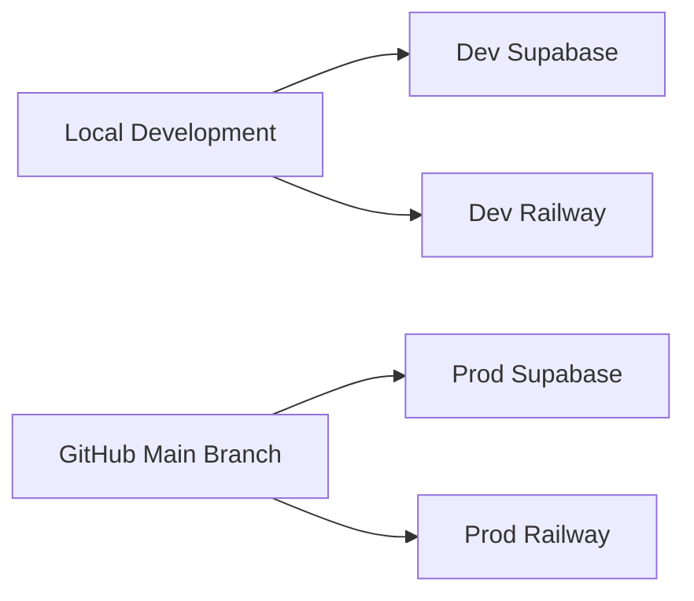

# Environment Configuration

FindU uses separate Supabase projects for development and production environments. This guide explains how to configure and manage these environments.

## Architecture Overview



<Info>
We use separate Supabase projects instead of branches due to Branching 2.0 limitations where preview branches can only merge to main.
</Info>

## The .env.local File

Your `.env.local` file in the findu root directory controls everything:

```bash
# Current environment (dev or prod)
SUPABASE_ENV=dev

# Production credentials
SUPABASE_PROJECT_ID_PROD=fhihneglvyiqwhvfedni
SUPABASE_DB_PASSWORD_PROD=<your-prod-password>
SUPABASE_ANON_KEY_PROD=<your-prod-anon-key>
SUPABASE_SERVICE_ROLE_KEY_PROD=<your-prod-service-key>

# Development credentials
SUPABASE_PROJECT_ID_DEV=gcoysibmtdyszenxxpxu
SUPABASE_DB_PASSWORD_DEV=<your-dev-password>
SUPABASE_ANON_KEY_DEV=<your-dev-anon-key>
SUPABASE_SERVICE_ROLE_KEY_DEV=<your-dev-service-key>

# Personal tokens
SUPABASE_ACCESS_TOKEN=<your-personal-token>
GITHUB_TOKEN=<your-github-token>
```

## Switching Environments

Use the findu CLI to switch between environments:

```bash
# Switch to development (recommended for daily work)
./findu env switch dev

# Switch to production (be very careful!)
./findu env switch prod

# Check current environment
./findu env status
```

<Warning>
Always double-check your environment before running migrations or making database changes!
</Warning>

## What Happens When You Switch

When you switch environments, the following updates automatically:

1. **Supabase CLI** - Points to the correct project
2. **MCP for Claude Code** - Updates database credentials
3. **Local environment variables** - All tools use the new settings

## Environment-Specific Features

### Development Environment
- Safe for experimentation
- Preview branches create here
- Test data and migrations
- Faster iteration cycles

### Production Environment
- Real user data
- Requires extra caution
- Deployment from main branch only
- Monitoring and backups enabled

## CI/CD Integration

GitHub Actions use organization secrets for each environment:

### Development Secrets
- `SUPABASE_URL_DEV`
- `SUPABASE_ANON_KEY_DEV`
- `SUPABASE_SERVICE_ROLE_KEY_DEV`
- `RAILWAY_TOKEN_DEV`

### Production Secrets
- `SUPABASE_URL_PROD`
- `SUPABASE_ANON_KEY_PROD`
- `SUPABASE_SERVICE_ROLE_KEY_PROD`
- `RAILWAY_TOKEN_PROD`

## Working with Preview Branches

Preview branches are temporary Supabase environments for testing:

```bash
# Created automatically when you open a PR
# Deleted automatically when PR is merged/closed
```

Each preview branch gets its own:
- Database copy (schema only, no data)
- Unique URL for testing
- Isolated environment

## Best Practices

<Steps>
  <Step title="Always work in development">
    Start your day by switching to dev:
    ```bash
    ./findu env switch dev
    ```
  </Step>
  
  <Step title="Test thoroughly before production">
    - Test all migrations in dev first
    - Run the app locally against dev
    - Get PR reviews before merging
  </Step>
  
  <Step title="Use preview branches for experiments">
    Preview branches are perfect for:
    - Testing breaking changes
    - Trying new features
    - Demonstrating work to teammates
  </Step>
  
  <Step title="Monitor production carefully">
    When in production:
    - Double-check every command
    - Have backups ready
    - Monitor error logs
  </Step>
</Steps>

## Troubleshooting

<AccordionGroup>
  <Accordion title="MCP not connecting to database">
    Run the MCP update script:
    ```bash
    ./findu update mcp
    ```
    Then restart Claude Code.
  </Accordion>
  
  <Accordion title="Wrong environment showing">
    Check your current environment:
    ```bash
    ./findu env status
    cat .env.local | grep SUPABASE_ENV
    ```
  </Accordion>
  
  <Accordion title="Can't switch environments">
    Make sure you have the required credentials in `.env.local` for both environments.
  </Accordion>
</AccordionGroup>

## Security Notes

- **Never commit `.env.local`** - It's gitignored for a reason
- **Rotate credentials regularly** - Especially if exposed
- **Use personal access tokens** - Not shared credentials
- **Limit production access** - Only when necessary

---

Next, learn about the [findu CLI commands](/developer/cli-reference) to speed up your workflow, or dive into [database operations](/database/overview) to understand how to work with Supabase.
