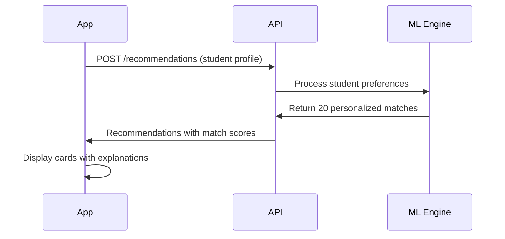
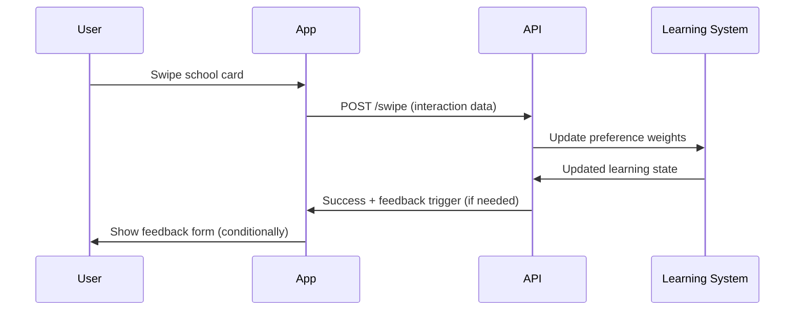

## Overview

The iOS app is fully integrated with the Python matching API v2 deployed at Railway, providing sophisticated personalized matching instead of random school selection.

## Architecture Components

### 1. Data Models (`APIModels.swift`)
- Request/response models for API communication
- Conversion methods between API and iOS models
- Feedback options for post-swipe collection

### 2. API Client (`MatchingAPIClient.swift`)
Complete API client with error handling and timeout configuration:
- **Production URL**: `https://findu-matching-production.up.railway.app`
- **Development URL**: `http://localhost:8000` (when DEBUG flag is set)

<CardGroup cols={2}>
  <Card title="Endpoints" icon="link">
    - `/recommendations` - Get personalized matches
    - `/swipe` - Record swipe interactions  
    - `/feedback` - Submit learning feedback
    - `/health` - Check API status
  </Card>
  
  <Card title="Configuration" icon="gear">
    Located in `MatchingAPIClient.swift` line 18
    
    Timeout: 30 seconds
    
    Retry logic: Built-in error handling
  </Card>
</CardGroup>

### 3. New ViewModels

#### CardsViewModelAPI
Replaces the original `CardsViewModel` with full API integration:
- Manages recommendation fetching
- Handles swipe recording
- Coordinates with learning system

#### LearningStateManager
Tracks learning phases for improved recommendations:
- **Discovery** (1-10 swipes): Initial preference learning
- **Refinement** (11-30 swipes): Fine-tuning matches
- **Stable** (31+ swipes): Consistent personalized results

#### FeedbackManager
Handles post-swipe feedback collection with smart triggering.

### 4. Updated Views

<Tabs>
  <Tab title="Core Views">
    - **SwipeableCardsViewAPI**: API-integrated swiping interface
    - **CardStackViewAPI**: Works with `CardModel` instead of `School`
    - **SwipeFeedbackView**: UI for collecting user feedback
  </Tab>
  
  <Tab title="Integration Points">
    - `ios_app.swift`: Now uses `CardsViewModelAPI`
    - `ExploreView.swift`: Uses `SwipeableCardsViewAPI`
    - `HomeView.swift`: Updated to use API view model
    - `GlobalStudentDataState`: Added `toRecommendationRequest()` method
  </Tab>
</Tabs>

### 5. Extended Models

#### CardModel
Enhanced with API-specific fields:
```swift
// New API fields
var matchScore: Double
var explanations: [String]
var isProbe: Bool
var matchedMajors: [String]
var distance: Double?
```

#### StudentSchoolInteraction
Added API tracking fields for learning system integration.

## Key Features

### 🎯 Personalized Matching
- Match scores from 0-100% based on student preferences
- Detailed explanations showing why schools were recommended
- Grade calculation (A/B/C/D/F) based on match score

### 🧠 Learning System
<Steps>
  <Step title="Discovery Phase (1-10 swipes)">
    Initial preference learning from user behavior
  </Step>
  
  <Step title="Refinement Phase (11-30 swipes)">
    Fine-tuning recommendations based on patterns
  </Step>
  
  <Step title="Stable Phase (31+ swipes)">
    Consistent personalized results with ongoing adaptation
  </Step>
</Steps>

### 🔍 Probe Schools
- Every 4th swipe tests preference boundaries
- Schools marked as probes for special algorithm handling
- Helps discover unexpected preferences

### 🌍 Geographic Intelligence
Smart geographic distribution:
- **50%** nearby schools (within preferred distance)
- **30%** slightly beyond preferences (expansion)
- **20%** discovery schools (new regions)

### 💬 Feedback Collection
- Smart triggering after pattern breaks or probe schools
- Minimal disruption with maximum 5 options
- Feeds directly back into learning algorithm

## Data Flow

### Initial Load Process



### Swipe Recording



## API Response Structure

<CodeGroup>
```json Recommendations Response
{
  "recommendations": [
    {
      "school": {
        "id": "uuid",
        "name": "Example University",
        "city": "Boston",
        "state": "MA"
        // ... full school data
      },
      "match_score": 0.75,
      "explanations": [
        "Strong Business program",
        "Perfect size match", 
        "Within your budget"
      ],
      "is_probe": false,
      "matched_majors": ["Business Administration"],
      "distance": 125.5
    }
  ],
  "learning_state": {
    "phase": "discovery",
    "progress": 0.4,
    "preference_weights": {
      "academic_selectivity": 0.8,
      "cost_weight": 0.6,
      "size_preference": 0.9
    }
  },
  "total_swipes": 4
}
```

```json Swipe Response  
{
  "success": true,
  "learning_state": {
    "phase": "refinement", 
    "progress": 0.7,
    "updated_weights": true
  },
  "trigger_feedback": true,
  "feedback_options": [
    "Too expensive",
    "Wrong location", 
    "No my major",
    "Too selective",
    "Perfect match!"
  ]
}
```
</CodeGroup>

## Testing the Integration

### 1. Build and Verify
<Steps>
  <Step title="Build and run the app">
    The app should automatically use API matching
  </Step>
  
  <Step title="Check console logs">
    Look for "[API]" prefixed logs indicating API calls
  </Step>
  
  <Step title="Verify API connection">
    Should see "Finding personalized matches..." loading state
  </Step>
</Steps>

### 2. Test Learning System
- Swipe through 10+ schools to trigger refinement phase
- Should see occasional feedback forms
- Match quality should improve over time
- Console logs show learning state changes

### 3. Debug API Issues
<AccordionGroup>
  <Accordion title="No recommendations loading">
    1. Check internet connection
    2. Verify API URL in `MatchingAPIClient.swift`
    3. Check Railway deployment status
    4. Ensure student profile is complete
  </Accordion>
  
  <Accordion title="Random schools appearing">
    1. Verify using `CardsViewModelAPI` not `CardsViewModel`
    2. Check for API error logs
    3. Ensure student exists in database
  </Accordion>
</AccordionGroup>

## Migration Guide

### From Random to API Matching

If you need to rollback to random matching:

<Warning>
Only use this for debugging. API matching provides significantly better user experience.
</Warning>

<Steps>
  <Step title="Update ios_app.swift">
    Change `CardsViewModelAPI` back to `CardsViewModel`
  </Step>
  
  <Step title="Update ExploreView.swift">
    - Change `SwipeableCardsViewAPI` → `SwipeableCardsView`
    - Change `CardsViewModelAPI` → `CardsViewModel`
  </Step>
  
  <Step title="Update HomeView.swift">
    Change `CardsViewModelAPI` back to `CardsViewModel`
  </Step>
</Steps>

## Known Limitations

<CardGroup cols={2}>
  <Card title="Network Dependency" icon="wifi">
    **No Offline Support**

    Requires active internet connection for recommendations
  </Card>
  
  <Card title="Profile Requirement" icon="user">
    **Complete Student Profile**
    
    API needs full student profile data to generate matches
  </Card>
  
  <Card title="Location Hardcoded" icon="location-dot">
    **NYC Coordinates**
    
    Currently uses hardcoded coordinates, needs geocoding integration
  </Card>
  
  <Card title="Error Recovery" icon="triangle-exclamation">
    **Limited Retry Logic**
    
    Basic error handling, could use more sophisticated retry mechanisms
  </Card>
</CardGroup>

## Next Steps

### Planned Enhancements

1. **Location Services Integration**
   - Request location permission
   - Geocode student address
   - Pass real coordinates to API

2. **Enhanced UI Features**
   - Show match explanations on cards
   - Display learning phase progress
   - Highlight matched majors with ⭐

3. **Improved Error Recovery**
   - Add retry mechanisms for failed requests
   - Better error messages for users
   - Fallback to cached data when offline

4. **Performance Optimizations**
   - Implement recommendation caching
   - Prefetch next batch of schools
   - Optimize image loading for better performance

---

For setup instructions and troubleshooting, see the [iOS API Setup Guide](/developer/ios-api-setup).