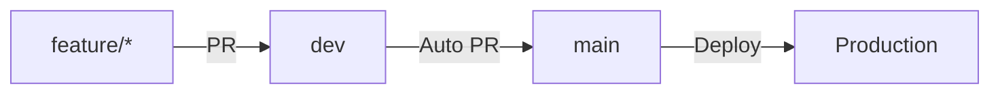
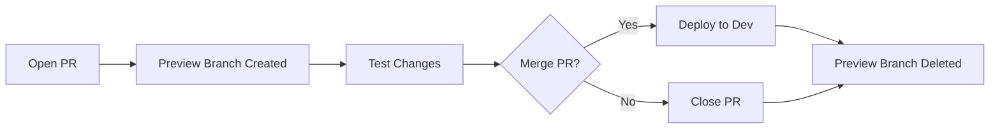
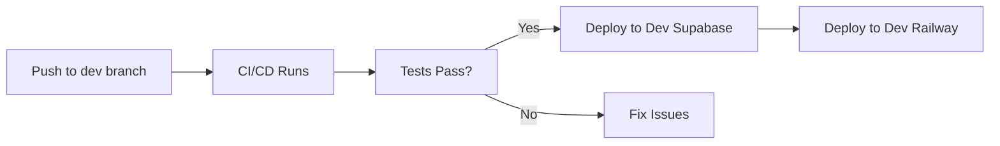
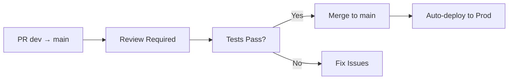

# Developer Workflow Guide

This guide covers common development workflows and best practices for working on the FindU platform.

## Daily Development Flow

<Steps>
  <Step title="Start your day">
    ```bash
    # Switch to development environment
    ./findu env switch dev
    
    # Pull latest changes from dev branch
    cd ~/findu/supabase && git checkout dev && git pull
    cd ~/findu/web_app && git checkout dev && git pull
    
    # Update dependencies
    ./findu update deps
    ```
  </Step>
  
  <Step title="Create a feature branch">
    ```bash
    # Create branch from dev (not main!)
    git checkout dev
    git pull origin dev
    git checkout -b feature/your-feature-name
    ```
  </Step>
  
  <Step title="Make your changes">
    - Write code
    - Add tests
    - Update documentation
  </Step>
  
  <Step title="Test locally">
    ```bash
    # Run component tests
    ./findu test web
    
    # Test against dev Supabase
    npm run dev
    ```
  </Step>
  
  <Step title="Open a PR">
    ```bash
    # Push your branch
    git push -u origin feature/your-feature-name
    
    # Open PR targeting dev branch
    # - Base: dev (not main!)
    # - Compare: feature/your-feature-name
    # Preview branch will be created automatically
    ```
  </Step>
</Steps>

## Branch Strategy

### Overview

FindU uses a three-tier branch strategy:



### Branch Protection Rules

1. **main branch**:
   - Requires PR with review
   - CI/CD must pass
   - No direct pushes
   - Deploys to production automatically

2. **dev branch**:
   - Requires PR (no review needed)
   - CI must pass
   - Direct pushes allowed for fixes
   - Deploys to dev Supabase automatically

3. **feature branches**:
   - No protection
   - Always branch from dev
   - Delete after merge

## Working with Supabase

### Creating Migrations

When you need to modify the database:

```bash
# 1. Make sure you're in dev
./findu env switch dev

# 2. Create a new migration
cd ~/findu/supabase
supabase migration new your_migration_name

# 3. Edit the migration file
# migrations/[timestamp]_your_migration_name.sql

# 4. Apply locally
supabase db push

# 5. Test your changes
# Then commit and push
```

<Warning>
Always test migrations in development first! Production migrations can't be easily rolled back.
</Warning>

### Using Preview Branches

Preview branches are automatically created when you open a PR:

1. **Automatic Creation**: Opens PR → Preview branch created
2. **Unique URL**: Each PR gets its own Supabase instance
3. **Schema Only**: No production data is copied
4. **Auto Cleanup**: Deleted when PR is closed/merged



## Working with the Web App

### Local Development

```bash
# 1. Start the dev server
cd ~/findu/web_app
npm run dev

# 2. Open http://localhost:5173
# 3. Make changes - hot reload active
```

### Adding New Features

<Tabs>
  <Tab title="New Page">
    ```bash
    # 1. Create component
    touch src/pages/NewFeature.tsx
    
    # 2. Add route
    # Edit src/App.tsx
    
    # 3. Update navigation
    # Edit src/components/nav-main.tsx
    ```
  </Tab>
  
  <Tab title="New Component">
    ```bash
    # 1. Check if shadcn/ui has it
    npx shadcn-ui@latest add [component]
    
    # 2. Or create custom
    mkdir src/components/custom
    touch src/components/custom/MyComponent.tsx
    ```
  </Tab>
  
  <Tab title="New API Integration">
    ```bash
    # 1. Add types
    # Edit src/types/database.types.ts
    
    # 2. Create hook
    touch src/hooks/useNewFeature.ts
    
    # 3. Use in component
    ```
  </Tab>
</Tabs>

## Working with Claude Code (MCP)

### Initial Setup

```bash
# 1. Install Claude Code desktop app
# 2. Update MCP configuration
./findu update mcp

# 3. Restart Claude Code
# 4. You now have Supabase access!
```

### Using MCP Effectively

<CodeGroup>
```sql create-table
-- Use MCP to create tables
mcp__supabase__apply_migration 
  name: "create_features_table"
  query: "CREATE TABLE features (...);"
```

```sql query-data
-- Query data directly
mcp__supabase__execute_sql
  query: "SELECT * FROM students LIMIT 10;"
```

```typescript search-docs
-- Search Supabase docs
mcp__supabase__search_docs
  graphql_query: "{ searchDocs(query: \"RLS policies\") { ... } }"
```
</CodeGroup>

## Git Workflow

### Branch Naming

Follow these conventions:

- `feature/description` - New features
- `fix/description` - Bug fixes
- `chore/description` - Maintenance tasks
- `docs/description` - Documentation only

### Commit Messages

Write clear, descriptive commits:

```bash
# Good
git commit -m "Add scholarship filtering by deadline"
git commit -m "Fix navigation menu z-index issue"
git commit -m "Update developer setup documentation"

# Bad
git commit -m "Fixed stuff"
git commit -m "WIP"
git commit -m "asdf"
```

### PR Guidelines

<Checklist>
- [ ] Descriptive title
- [ ] Clear description of changes
- [ ] Link to related issues
- [ ] Tests pass
- [ ] Documentation updated
- [ ] Screenshots for UI changes
</Checklist>

## Deployment Process

### To Development



### To Production



## Common Tasks

### Adding Environment Variables

<Tabs>
  <Tab title="Local Development">
    ```bash
    # 1. Add to .env.local
    echo "NEW_VAR=value" >> ~/.findu/.env.local
    
    # 2. Update templates
    # Edit dev-tools/templates/.env.local.template
    ```
  </Tab>
  
  <Tab title="CI/CD">
    ```bash
    # Add to GitHub Organization Secrets:
    # - NEW_VAR_DEV (for development)
    # - NEW_VAR_PROD (for production)
    
    # Update workflows to use them
    ```
  </Tab>
  
  <Tab title="Railway">
    ```bash
    # Add in Railway dashboard:
    # 1. Go to project settings
    # 2. Add environment variable
    # 3. Redeploy service
    ```
  </Tab>
</Tabs>

### Debugging Issues

<AccordionGroup>
  <Accordion title="Database connection issues">
    ```bash
    # Check environment
    ./findu env status
    
    # Update MCP
    ./findu update mcp
    
    # Verify credentials
    supabase status
    ```
  </Accordion>
  
  <Accordion title="Build failures">
    ```bash
    # Clear caches
    rm -rf node_modules
    npm install
    
    # Check for type errors
    npm run typecheck
    ```
  </Accordion>
  
  <Accordion title="Preview branch not working">
    Check:
    - PR is from a branch in the same repo
    - Supabase Branching 2.0 is enabled
    - No migration conflicts
  </Accordion>
</AccordionGroup>

## Best Practices

### Code Quality

1. **Follow existing patterns** - Check nearby code
2. **Write tests** - Especially for critical paths
3. **Handle errors gracefully** - Users should never see crashes
4. **Optimize for performance** - Profile before optimizing

### Security

1. **Never commit secrets** - Use environment variables
2. **Validate all inputs** - Both client and server side
3. **Use RLS policies** - Supabase row-level security
4. **Regular dependency updates** - Keep packages current

### Team Collaboration

1. **Communicate in PRs** - Document your thinking
2. **Review thoughtfully** - Test locally when needed
3. **Ask questions** - No question is too simple
4. **Share knowledge** - Update docs as you learn

## Useful Resources

<CardGroup cols={2}>
  <Card title="Supabase Docs" icon="database" href="https://supabase.com/docs">
    Database, auth, and storage reference
  </Card>
  <Card title="React Docs" icon="react" href="https://react.dev">
    React patterns and best practices
  </Card>
  <Card title="Tailwind CSS" icon="palette" href="https://tailwindcss.com">
    Utility-first CSS framework
  </Card>
  <Card title="FindU Slack" icon="slack" href="#">
    Internal team communication
  </Card>
</CardGroup>

---

Questions? Need help? Don't hesitate to ask in #dev-help on Slack!