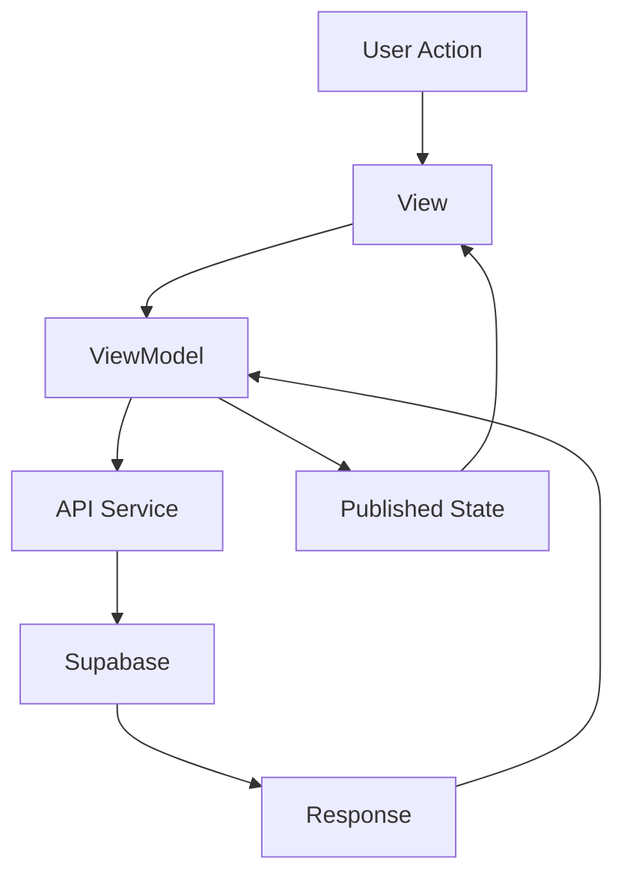

# iOS App Overview

The FindU iOS app is a native SwiftUI application that helps students discover their perfect college match through an intuitive swiping interface.

## Architecture

The app follows the MVVM (Model-View-ViewModel) pattern with feature-based organization:

### Project Structure
```
ios_app/
├── Features/              # Feature modules
│   ├── auth/             # Authentication flow
│   ├── profileCreation/  # Onboarding
│   ├── swiping/          # Card interface
│   ├── messages/         # Chat system
│   └── scholarships/     # Financial aid
├── Shared/               # Shared components
├── Services/             # API & data services
└── Utils/                # Utilities
```

### Architecture Principles

#### MVVM Pattern
```swift
// Model
struct School: Identifiable {
    let id: String
    let name: String
    let matchScore: Double
}

// ViewModel
@MainActor
class SwipingViewModel: ObservableObject {
    @Published var schools: [School] = []
    @Published var isLoading = false
    
    func loadSchools() async {
        isLoading = true
        schools = await api.fetchRecommendations()
        isLoading = false
    }
}

// View
struct SwipingView: View {
    @StateObject private var viewModel = SwipingViewModel()
    
    var body: some View {
        // UI implementation
    }
}
```

## Key Features

### Authentication System
- **Providers**: Apple Sign In, Google Sign In, Email
- **State Management**: Managed through `AuthState` enum
- **Supabase Integration**: Handles user sessions
- **Deep Linking**: Support for magic links

### Profile Creation Flow
Multi-step onboarding that collects:
1. Basic Information
2. Academic Profile
3. Preferences
4. Location & Demographics

### Swiping Interface
- **Card Stack**: Tinder-style interface
- **Gestures**: Swipe, tap, and drag support
- **Real-time Learning**: Algorithm adapts to swipes
- **Match Details**: Expandable college information

### Messaging System
- **Real-time Chat**: WebSocket-based updates
- **AI Advisor**: Integrated college counselor
- **Rich Messages**: Support for links, images
- **Notifications**: Push notification support

## Data Flow



## State Management

### Global State
Managed through singletons and environment objects:

```swift
// Global student data
class GlobalStudentDataState: ObservableObject {
    static let shared = GlobalStudentDataState()
    @Published var studentInfo: StudentInfo?
    @Published var hasCompletedOnboarding: Bool
}

// Usage in views
@EnvironmentObject var globalState: GlobalStudentDataState
```

### Local State
Component-specific state using `@State` and `@StateObject`:

```swift
struct CollegeDetailView: View {
    @State private var isExpanded = false
    @State private var selectedTab = 0
    
    var body: some View {
        // View implementation
    }
}
```

## Navigation Patterns

### Tab-Based Navigation
Main app navigation uses tabs:
- Home (Swiping)
- Messages
- Scholarships
- Profile

### Modal Presentations
Used for:
- Profile creation
- College details
- Settings
- Share sheets

### Navigation Stack
Deep navigation within features:
```swift
NavigationStack {
    MessageListView()
        .navigationDestination(for: Conversation.self) { conversation in
            ChatDetailView(conversation: conversation)
        }
}
```

## Network Layer

### API Client Pattern
```swift
class MatchingAPIClient {
    static let shared = MatchingAPIClient()
    
    func fetchRecommendations(for studentId: String) async throws -> [School] {
        let response = try await supabase
            .rpc("get_recommendations", params: ["student_id": studentId])
            .execute()
        
        return try decoder.decode([School].self, from: response.data)
    }
}
```

### Error Handling
```swift
enum APIError: LocalizedError {
    case networkError
    case decodingError
    case unauthorized
    
    var errorDescription: String? {
        switch self {
        case .networkError:
            return "Network connection error"
        case .decodingError:
            return "Data format error"
        case .unauthorized:
            return "Please log in again"
        }
    }
}
```

## UI Components

### Custom Components
- `SchoolCard`: Swipeable card view
- `MatchScoreView`: Visual match percentage
- `StatTag`: Information badges
- `MessageBubble`: Chat UI elements

### Design System
- **Colors**: Defined in Assets catalog
- **Typography**: Custom fonts (Plus Jakarta Sans)
- **Spacing**: Consistent padding system
- **Animations**: Spring-based transitions

## Performance Optimization

### Image Loading
- Lazy loading with AsyncImage
- Caching strategy
- Thumbnail optimization

### Data Management
- Pagination for large lists
- Incremental loading
- Background refresh

### Memory Management
- Proper use of weak references
- View recycling in lists
- Image cache limits

## Testing Approach

### Unit Tests
```swift
class StudentProfileTests: XCTestCase {
    func testProfileValidation() {
        let profile = StudentProfile(name: "", email: "test@example.com")
        XCTAssertFalse(profile.isValid)
    }
}
```

### UI Tests
```swift
class OnboardingUITests: XCTestCase {
    func testCompleteOnboarding() {
        let app = XCUIApplication()
        app.launch()
        
        // Test onboarding flow
        app.buttons["Get Started"].tap()
        // ... more interactions
    }
}
```

## Debugging

### Debug Helpers
- Console logging with emojis
- Network request inspection
- State change tracking
- Performance monitoring

### Common Issues
1. **Profile Creation**: Check response format
2. **Authentication**: Verify Supabase config
3. **Push Notifications**: Check entitlements
4. **Deep Links**: Verify URL schemes

## Next Steps

- [SwiftUI Patterns](/ios-app/swiftui-patterns)
- [Navigation Guide](/ios-app/navigation)
- [Debugging Guide](/ios-app/debugging)
- [Testing Strategies](/ios-app/testing)