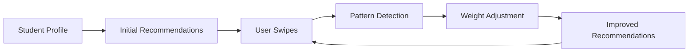

# Matching Algorithm Overview

The FindU matching algorithm is a sophisticated ML system that learns from user behavior to provide increasingly personalized college recommendations.

## How It Works

### Core Concept
The algorithm uses a multi-factor scoring system that considers:
- Academic fit (test scores, GPA, selectivity)
- Financial fit (cost, aid, family income)
- Cultural fit (size, location, campus culture)
- Outcome fit (graduation rates, career prospects)

### Learning System


## Algorithm Phases

### Phase 1: Discovery (0-10 swipes)
- **Goal**: Learn basic preferences
- **Strategy**: High diversity in recommendations
- **Exploration Rate**: 30%
- **UI Feedback**: "Learning your preferences..."

### Phase 2: Refinement (10-30 swipes)
- **Goal**: Narrow down preferences
- **Strategy**: Test preference boundaries
- **Exploration Rate**: 20%
- **UI Feedback**: "Refining matches..."

### Phase 3: Stable (30+ swipes)
- **Goal**: Deliver best matches
- **Strategy**: Exploit learned preferences
- **Exploration Rate**: 10%
- **UI Feedback**: "Personalized for you"

## Scoring System

### Base Score Calculation
```python
def calculate_match_score(student, school):
    # Start with neutral score
    base_score = 0.5
    
    # Add dimensional bonuses
    academic_bonus = calculate_academic_fit(student, school) * 0.35
    financial_bonus = calculate_financial_fit(student, school) * 0.25
    campus_bonus = calculate_campus_fit(student, school) * 0.20
    outcome_bonus = calculate_outcome_fit(student, school) * 0.20
    
    final_score = base_score + academic_bonus + financial_bonus + 
                  campus_bonus + outcome_bonus
    
    return min(max(final_score, 0), 1)  # Clamp to [0, 1]
```

### Grade Mapping
- **A+**: 90-100% - Perfect matches
- **A**: 85-89% - Excellent matches
- **A-**: 80-84% - Very good matches
- **B+**: 75-79% - Good matches
- **B**: 70-74% - Solid matches
- **B-**: 65-69% - Decent matches
- **C+**: 60-64% - Acceptable matches
- **C**: 55-59% - Marginal matches

## Key Innovations

### 1. Probe School Strategy
Strategically inserts "probe" schools to test preference boundaries:
```python
def should_insert_probe(swipe_count, phase):
    if phase == "discovery":
        return swipe_count % 4 == 0  # 25% probes
    elif phase == "refinement":
        return swipe_count % 6 == 0  # 17% probes
    else:
        return swipe_count % 10 == 0  # 10% probes
```

### 2. Thompson Sampling
Uses multi-armed bandit approach for exploration/exploitation:
```python
class ThompsonSampler:
    def __init__(self):
        self.alpha = defaultdict(lambda: 1)  # Successes
        self.beta = defaultdict(lambda: 1)   # Failures
    
    def sample(self, school_id):
        # Draw from Beta distribution
        return np.random.beta(
            self.alpha[school_id], 
            self.beta[school_id]
        )
    
    def update(self, school_id, liked):
        if liked:
            self.alpha[school_id] += 1
        else:
            self.beta[school_id] += 1
```

### 3. Real-time Weight Learning
Adapts feature weights based on swipe patterns:
```python
def update_weights(current_weights, swipe_data):
    learning_rate = get_learning_rate(swipe_count)
    
    for feature in features:
        gradient = calculate_gradient(feature, swipe_data)
        current_weights[feature] += learning_rate * gradient
    
    # Normalize weights
    total = sum(current_weights.values())
    for feature in current_weights:
        current_weights[feature] /= total
    
    return current_weights
```

## Feature Engineering

### Academic Features
- **SAT/ACT Percentile Match**: How student compares to school's admitted students
- **Selectivity Alignment**: Match between student strength and school selectivity
- **Academic Rigor Preference**: High/Medium/Low preference handling

### Financial Features
- **Affordability Score**: Net price vs. family budget
- **Value Score**: Outcomes relative to cost
- **Aid Availability**: Merit and need-based aid chances

### Cultural Features
- **Size Preference**: Small/Medium/Large with fuzzy boundaries
- **Location Match**: Distance and urban/rural preferences
- **Culture Vectors**: Greek life, research, diversity, etc.

### Outcome Features
- **Graduation Rate**: 4-year and 6-year rates
- **Employment Outcomes**: Post-graduation employment
- **Earnings Potential**: Median earnings by major

## Performance Optimizations

### Caching Strategy
```python
class SchoolCache:
    def __init__(self):
        self.cache = {}
        self.ttl = 86400  # 24 hours
    
    def get_schools(self):
        if self.is_expired():
            self.refresh()
        return self.cache['schools']
```

### Batch Processing
- Load schools in chunks of 100
- Vectorized operations with NumPy
- Parallel score calculation

### Mobile Optimization
- Compressed responses (field shortening)
- Aggressive caching (5min recommendations)
- Pagination support
- Offline-first architecture

## Integration Points

### API Endpoints
- `POST /recommendations` - Get personalized matches
- `POST /swipe` - Record interaction
- `GET /match/{student_id}/{school_id}` - Detailed match breakdown

### Data Requirements
From student profile:
- Academic data (GPA, test scores)
- Preferences (size, location, major)
- Demographics (for financial aid)
- Interaction history

From school data:
- Admission statistics
- Cost and aid data
- Outcome metrics
- Campus characteristics

## Monitoring & Analytics

### Key Metrics
- **Match Quality**: Average match scores
- **Engagement**: Swipe-through rates
- **Learning Efficiency**: Convergence speed
- **Diversity**: Recommendation variety

### A/B Testing Framework
```python
def get_algorithm_variant(student_id):
    if hash(student_id) % 100 < 10:
        return "experimental"
    else:
        return "control"
```

## Future Enhancements

### Planned Improvements
1. **Collaborative Filtering**: Learn from similar students
2. **Temporal Patterns**: Time-based preference changes
3. **Multi-objective Optimization**: Balance multiple goals
4. **Explainable AI**: Better match explanations

### Research Areas
- Deep learning for preference modeling
- Graph neural networks for school relationships
- Reinforcement learning for long-term outcomes
- Natural language processing for essays

## Next Steps

- [API Reference](/matching-algorithm/api-reference)
- [Algorithm Deep Dive](/matching-algorithm/algorithm-details)
- [Performance Tuning](/matching-algorithm/performance)