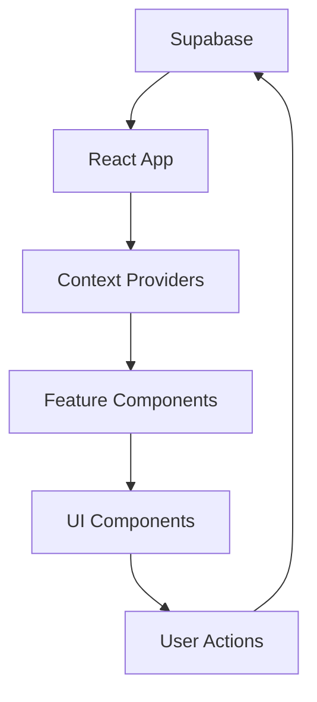

# Web App Overview

The FindU web app is a React-based dashboard that enables schools and partners to manage their presence, view analytics, and communicate with prospective students.

## Architecture

The web app follows a modern React architecture with these key principles:

### Component Structure
```
src/
├── components/      # Reusable UI components
│   ├── ui/         # Base shadcn/ui components
│   └── custom/     # App-specific components
├── features/       # Feature-based organization
├── hooks/          # Custom React hooks
├── lib/            # Utilities and helpers
└── types/          # TypeScript definitions
```

### State Management
We use a combination of:
- **React Context** for global state (auth, user data)
- **Local state** for component-specific data
- **Supabase real-time** for live updates
- **Custom hooks** for shared logic

### Data Flow


## Key Concepts

### Feature-Based Organization
Each major feature has its own directory containing:
- Page components
- Feature-specific components
- Custom hooks
- Type definitions

Example structure:
```
features/
├── campaigns/
│   ├── campaigns.tsx        # Main page
│   ├── studenttable.tsx     # Data table
│   ├── studentfilters.tsx   # Filter UI
│   └── types.ts            # Types
```

### Authentication Flow
1. User logs in via Supabase Auth
2. Auth state managed by context
3. Protected routes check permissions
4. Role-based UI rendering

### Real-time Updates
The app uses Supabase subscriptions for:
- New messages
- Student interactions
- Analytics updates
- Team member changes

## Development Patterns

### Component Patterns
```tsx
// Feature component with data fetching
export function CampaignsPage() {
  const { data, loading } = useCampaigns();
  
  if (loading) return <LoadingState />;
  
  return (
    <PageLayout>
      <StudentTable data={data} />
    </PageLayout>
  );
}
```

### Custom Hooks
```tsx
// Shared data logic
export function useCampaigns() {
  const [data, setData] = useState([]);
  const [loading, setLoading] = useState(true);
  
  useEffect(() => {
    fetchCampaigns().then(setData);
  }, []);
  
  return { data, loading };
}
```

### Error Handling
- Global error boundary for crashes
- Toast notifications for user feedback
- Graceful degradation for missing data

## Performance Considerations

### Code Splitting
- Route-based splitting with React.lazy
- Component lazy loading for heavy features
- Dynamic imports for optional features

### Optimization Techniques
- React.memo for expensive components
- useMemo/useCallback for computations
- Virtual scrolling for large lists
- Image lazy loading

### Caching Strategy
- SWR pattern for data fetching
- Local storage for user preferences
- Session storage for temporary data

## Deployment Architecture

The web app is deployed on Railway with:
- Automatic deployments from GitHub
- Environment-based configuration
- CDN for static assets
- Health check endpoints

## Next Steps

- [Component Library Guide](/web-app/components)
- [State Management Patterns](/web-app/state-management)
- [Styling with Tailwind](/web-app/styling-guide)
- [Testing Strategies](/web-app/testing)